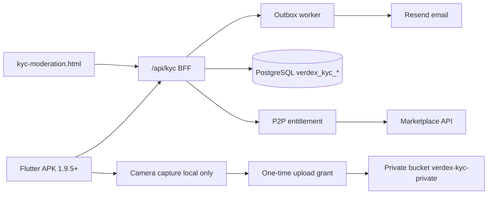
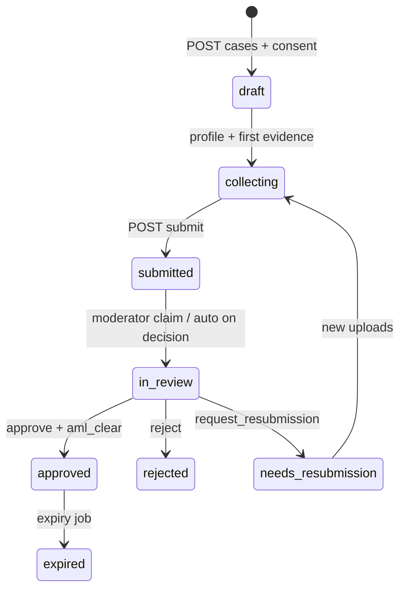

# Verdex Android KYC/AML — Mainnet Implementation Specification

**Status:** Implementation specification + **backend shipped** in this repository  
**Scope:** Android identity verification, in-house human review, AML screening, P2P entitlement, moderator console, secure evidence, audit, email  
**Network:** production/mainnet only  
**APK target:** 1.9.5+  
**Related:** `MANUAL_KYC_AML_OPERATIONS.md`, `ANDROID_P2P_MAINNET_SPEC.md`, migration `20260718113000_p2p_kyc_aml_rbac_foundation.sql`, `20260718140000_kyc_identity_profiles_and_chain.sql`

---

## 0. What is implemented in-repo

| Component | Path |
|-----------|------|
| API router | `api/kyc.js` → `/api/kyc?action=…` |
| User handlers | `api/_kyc/config.js`, `me.js`, `cases.js`, `profile.js`, `uploads.js`, `submit.js` |
| Moderator handlers | `api/_kyc/admin-queue.js`, `admin-case.js` |
| Outbox worker | `api/_kyc/outbox-worker.js` (cron every 10 min) |
| Shared logic | `api/_kyc/lib.js` |
| Verification email | `sendKycVerifiedEmail` in `api/_lib.js` + outbox |
| Moderator UI | `kyc-moderation.html` → `/kyc-moderation` |
| APK/JS client helper | `js/kyc-client.js` |
| DB foundation | Supabase migrations above |

---

## 1. Objectives and non-negotiable rules

1. Google sign-in **prefills only**. It never grants `verified` or P2P.
2. **Server only** sets case status, KYC tier, `verdex_p2p_entitlements`, and sends the official verification email.
3. APK never keeps raw document/selfie bytes after upload receipt; capture is camera-only by default (no gallery).
4. No document images, biometrics, government IDs, or scores in analytics, crash logs, or push bodies.
5. Decisions and evidence views are **immutable audit events** (hash chain via `verdex_record_audit_event` when available).
6. In-house human review is the default operator model (`provider_name = manual_internal`), with optional future vendor plug-in without changing entitlement model.
7. Successful approval: `kyc status = approved` **and** AML `clear` **and** `p2p entitlement = eligible` **and** confirmation email queued/sent.

---

## 2. System architecture



---

## 3. Identity model and P2P entitlement

### 3.1 Case states (DB enum)

```text
draft → collecting → submitted → in_review → approved | rejected | needs_resubmission
                                      ↘ expired / withdrawn (terminal / restart)
```

Enforced by trigger `verdex_validate_kyc_case_transition`.

### 3.2 Entitlement predicate

```text
p2p_eligible ⇔
  entitlement.state = eligible
  AND (expires_at IS NULL OR expires_at > now())
  AND kyc.status = approved AND not expired
  AND aml.status = clear AND not expired
  AND platform.p2p_enabled
  AND account not banned
```

Client reads only `GET /api/kyc?action=me` → `p2p_eligible`.

### 3.3 Tiers

| Tier | Meaning | Capability |
|------|---------|------------|
| 0 | Not approved | No P2P |
| 1 | standard approval | Default P2P limits |
| 2 | enhanced | Higher limits (policy) |

---

## 4. Android UI specification (normative wireframes)

Use full-screen stepper, 48dp targets, MAINNET badge, localized copy. Progress `n/5`.

### 4.1 Entry + consent (step 1/5)

```text
┌─────────────────────────────────────────────┐
│ Verify your identity                     1/5 │
│ MAINNET · Real VDX                          │
│─────────────────────────────────────────────│
│ To use Verdex P2P with mainnet VDX, we need │
│ to verify your identity and run safety      │
│ checks.                                     │
│ • Usually minutes to a few hours (human)    │
│ • Documents encrypted at rest               │
│ • Required before P2P access                │
│ [ Privacy & data use ]                      │
│ ☐ I agree to identity-verification terms    │
│ ☐ I confirm I meet the minimum age          │
│                         [ Continue ]        │
└─────────────────────────────────────────────┘
```

Continue disabled until both boxes checked. Record `consent_version`, locale, timestamp, account id, IP/device HMAC in audit on `POST cases`.

### 4.2 Country (step 2/5)

```text
┌─────────────────────────────────────────────┐
│ Where do you live?                       2/5 │
│ [ Search country                         ]  │
│  🇵🇰 Pakistan   🇦🇪 UAE   🇬🇧 UK   …         │
│ We show documents accepted in your region.  │
│                         [ Continue ]        │
└─────────────────────────────────────────────┘
```

Countries come from `GET config` only. Unsupported → stop (no case).

### 4.3 Google prefill + profile (step 3/5)

```text
┌─────────────────────────────────────────────┐
│ Confirm your details                     3/5 │
│ Full legal name  [ Google display name   ]  │
│ Email            [ user@gmail.com     ] 🔒  │
│ Date of birth    [ DD / MM / YYYY        ]  │
│ Nationality      [ Select                ]  │
│ Document type    ○ Passport ○ National ID   │
│                  ○ Driver licence           │
│ Google only prefills — it does not verify.  │
│                         [ Continue ]        │
└─────────────────────────────────────────────┘
```

API: `POST /api/kyc?action=profile&id={caseId}`.

### 4.4 Document capture (step 4/5)

```text
Front:
┌─────────────────────────────────────────────┐
│ Capture front                            4/5 │
│     ┌───────────────────────┐               │
│     │ Align all four edges  │               │
│     └───────────────────────┘               │
│ [ Retake ]  [ Use photo ]                   │
└─────────────────────────────────────────────┘
```

If `national_id` / `driver_licence` → repeat for **back**. No gallery. On Use photo:

1. `POST uploads` grant (`evidence_kind=document-front|document-back`)
2. PUT to `upload_url` if present
3. `POST uploads&sub=complete` with `checksum_sha256`, `upload_token`
4. Secure-delete local file

### 4.5 Live selfie + liveness (step 5/5)

```text
┌─────────────────────────────────────────────┐
│ Verify it is you                         5/5 │
│              ◯ Face guide                   │
│ Follow prompts: turn left → blink → …       │
│ [ Start live check ]                        │
└─────────────────────────────────────────────┘
```

Grant response includes `liveness.sequence`. Complete upload must send `liveness_challenge_id` + `liveness_completed=true`.

### 4.6 Submitted / success

```text
Submitted:
│ Your information was submitted securely.    │
│ [ View verification status ]                │

Success (only if me.p2p_eligible):
│ ✓ Identity verified                         │
│ Eligible for P2P under current mainnet      │
│ limits.                                     │
│ [ Open P2P marketplace ]                    │
```

Never show verified from a push payload alone — always re-fetch `me`.

---

## 5. Backend state machine



On **approve**:

1. Case → `approved` + `expires_at` (~365d)
2. AML screening row `clear`
3. Entitlement `eligible` (same logical transaction sequence)
4. Outbox: email + push + in_app
5. Immediate best-effort `sendKycVerifiedEmail`
6. Audit `kyc.case.approved`

---

## 6. API specification (implemented)

Base: `https://verdexswap.site/api/kyc?action=`  
Auth: `Authorization: Bearer <supabase_access_token>`  
Mutations: `X-Idempotency-Key` (8–255 chars), `X-Trace-Id`

### 6.1 User endpoints

| Action | Method | Purpose |
|--------|--------|---------|
| `config` | GET | Countries, docs, policy/consent versions |
| `me` | GET | Redacted status + `p2p_eligible` |
| `cases` | POST | Create/resume case |
| `profile` | POST `&id=` | Legal name DOB nationality document type |
| `uploads` | POST `&id=` | One-time upload grant + liveness challenge |
| `uploads` | POST `&id=&sub=complete` | Register evidence metadata |
| `submit` | POST `&id=` | Queue for human review |

### 6.2 Moderator endpoints

| Action | Method | Purpose |
|--------|--------|---------|
| `admin-queue` | GET | Review queue + SLA + last scores |
| `admin-case` | GET `&id=&sub=detail` | Case + evidence meta + AML |
| `admin-case` | POST `&id=&sub=claim` | Claim → `in_review` |
| `admin-case` | POST `&id=&sub=evidence-url` | 60s signed URL (audited) |
| `admin-case` | POST `&id=&sub=decision` | approve / reject / resub / aml_hold |

### 6.3 Example: start case

```http
POST /api/kyc?action=cases
X-Idempotency-Key: …
```

```json
{
  "country_code": "PK",
  "consent_version": "kyc-consent-2026-07-18",
  "privacy_accepted": true,
  "age_attested": true,
  "google_prefill": { "identity_provider": "google", "subject": "opaque" }
}
```

### 6.4 Example: me (eligible)

```json
{
  "case_id": "uuid",
  "status": "approved",
  "tier": 1,
  "p2p_eligible": true,
  "p2p_entitlement_state": "eligible",
  "next_action": { "type": "open_p2p", "message": "…" }
}
```

### 6.5 Example: decision approve

```json
{
  "decision": "approve",
  "reason_code": "documents_clear_face_match_ok",
  "document_confidence": 0.95,
  "liveness_confidence": 0.96,
  "face_match_confidence": 0.93,
  "aml_clear": true,
  "second_approval": false
}
```

Low scores (`doc < 0.90` or `live < 0.92` or `face < 0.88`) require `second_approval: true`.

### 6.6 Error envelope

```json
{
  "error": {
    "code": "EVIDENCE_INCOMPLETE",
    "message": "Document front and live selfie are required.",
    "retryable": false,
    "trace_id": "…"
  }
}
```

---

## 7. Database schema

### 7.1 Foundation (existing)

- `verdex_kyc_cases`, `verdex_kyc_evidence`, `verdex_kyc_review_actions`
- `verdex_aml_screenings`, `verdex_p2p_entitlements`
- `verdex_staff_roles`, `verdex_notification_outbox`
- `verdex_api_idempotency_keys`, `verdex_audit_events`

### 7.2 Additive

- `kyc_identity_profiles` (ciphertext name/DOB)
- chain tables for P2P (`verdex_chain_events`, `verdex_trade_attestations`, …)

Evidence **bytes** live in private Storage bucket `verdex-kyc-private`; DB holds object key + SHA-256 only.

---

## 8. Confidence scores and policy

Scores are **decision support** (0.0000–1.0000), entered by moderators:

| Signal | Soft auto path | Else |
|--------|----------------|------|
| document ≥ 0.90 | allow single reviewer if AML clear | second approval |
| liveness ≥ 0.92 | same | second approval |
| face_match ≥ 0.88 | same | second approval |

APK never receives raw scores — only generic next_action.

---

## 9. Moderator dashboard

**URL:** `/kyc-moderation` (`kyc-moderation.html`)

Features:

- Queue with country, status, SLA minutes, last scores  
- Case detail, claim, 60s evidence view (audited)  
- Score inputs + reason code  
- Approve (+ P2P + email), reject, resubmission, AML hold  
- Self-review blocked server-side  

Staff auth: Supabase session + `verdex_staff_roles` moderator/administrator **or** bootstrap `VERDEX_ADMIN_EMAILS`.

---

## 10. Email and notifications

On approve, same flow writes outbox:

| Channel | template_key | Dedupe |
|---------|--------------|--------|
| email | `kyc-verification-confirmed-v1` | `kyc-verified:{caseId}:{policy}` |
| push | `kyc-status-changed-v1` | `kyc-push-verified:{caseId}` |
| in_app | `kyc-verified-banner-v1` | `kyc-inapp-verified:{caseId}` |

Email subject: `Verdex — Identity verified · P2P access enabled`  
No document type, ID numbers, scores, or balances in the body.

Worker: `GET/POST /api/kyc?action=outbox` with `CRON_SECRET` (scheduled `*/10 * * * *`).

---

## 11. Error handling

| Condition | Code / behavior |
|-----------|-----------------|
| Unsupported country | `COUNTRY_NOT_SUPPORTED` |
| Consent mismatch | `CONSENT_VERSION_MISMATCH` |
| Incomplete evidence | `EVIDENCE_INCOMPLETE` |
| Liveness missing | `LIVENESS_REQUIRED` |
| Upload token expired | `UPLOAD_TOKEN_INVALID` retryable |
| Idempotency reuse | `IDEMPOTENCY_KEY_REUSE` |
| Self review | `SELF_REVIEW_FORBIDDEN` |
| Low scores w/o dual control | `SECOND_APPROVAL_REQUIRED` |
| Storage not provisioned | `EVIDENCE_STORAGE_UNAVAILABLE` |
| Rate limit | `RATE_LIMITED` |

---

## 12. Security controls

- OAuth bearer; no service role in APK  
- Idempotency + request hash  
- Upload tokens HMAC-signed, 5 minutes, bound to user/case/kind/size  
- Evidence URLs 60s, moderator-only, audited  
- IP/UA stored as HMAC/SHA-256 only  
- Field ciphertext for legal name/DOB when `kyc_identity_profiles` present  
- RLS: clients cannot write KYC/entitlement tables  
- Gallery import disabled  
- Content-type + 25MB cap  
- Certificate pinning recommended on APK (`core_security`)  
- Play Integrity as risk signal only  

### Env vars

| Variable | Purpose |
|----------|---------|
| `SUPABASE_URL` / `SUPABASE_SERVICE_ROLE_KEY` | API DB |
| `RESEND_API_KEY` / `SENDER_EMAIL` | Mail |
| `VERDEX_ADMIN_EMAILS` | Bootstrap staff |
| `VERDEX_KYC_POLICY_VERSION` | Policy pin |
| `VERDEX_KYC_CONSENT_VERSION` | Consent pin |
| `VERDEX_UPLOAD_TOKEN_SECRET` | Upload HMAC |
| `VERDEX_PII_HMAC_SECRET` | IP/PII HMAC |
| `VERDEX_KYC_BUCKET` | default `verdex-kyc-private` |
| `CRON_SECRET` | Outbox worker |

### Storage setup (ops)

1. Create private bucket `verdex-kyc-private` (no public policies).  
2. Apply both SQL migrations.  
3. Seed two listing grants + staff moderator roles offline.  
4. Configure Resend domain.  
5. Open `/kyc-moderation` with staff account.

---

## 13. Android package map

| Package | Responsibility |
|---------|----------------|
| `feature_kyc` | Stepper UI, camera, liveness UX |
| `core_api` | Calls `/api/kyc`, idempotency, errors |
| `core_security` | Keystore temp files, delete after upload, pin |
| `feature_marketplace` | Gates on `p2p_eligible` from `me` |

Reference JS: `js/kyc-client.js` (`VerdexKycClient.STEPS`).

---

## 14. End-to-end acceptance tests

1. User consents → country PK → profile → passport front + live selfie → submit.  
2. `me.status=submitted`, `p2p_eligible=false`.  
3. Moderator claims, views evidence URL (audit row), approves with AML clear.  
4. `me.status=approved`, `p2p_eligible=true`.  
5. User receives verification email exactly once (dedupe).  
6. Regular user cannot call `admin-queue` (403).  
7. Moderator cannot approve own account.  
8. Low scores without `second_approval` rejected.  
9. Resubmission path returns user to capture.  
10. Reject revokes entitlement.

---

## 15. Definition of done

- [x] Enterprise KYC/AML API on Vercel  
- [x] Moderator dashboard with confidence scores  
- [x] DB migrations for cases, evidence, AML, entitlements, audit, outbox  
- [x] Approve → verified + P2P eligible + email  
- [x] Upload grants, liveness challenge binding, idempotency  
- [x] Full UI wireframes + state diagrams in this doc  
- [ ] APK Flutter UI wired to these APIs (client app repo / next APK cut)  
- [ ] Private storage bucket provisioned in production  
- [ ] Staff roles seeded; legal policy sign-off per jurisdiction  

---

## 16. Document control

| Version | Date | Notes |
|---------|------|-------|
| 2.0.0 | 2026-07-18 | Backend implementation + moderator UI + email/outbox; mainnet-only; aligned to Supabase foundation |

*End of specification.*
