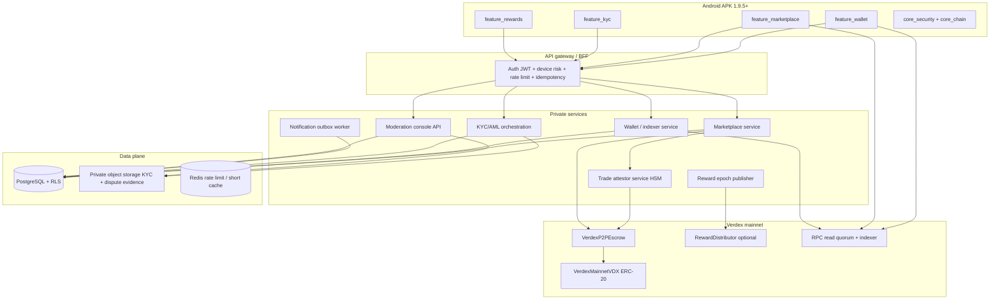
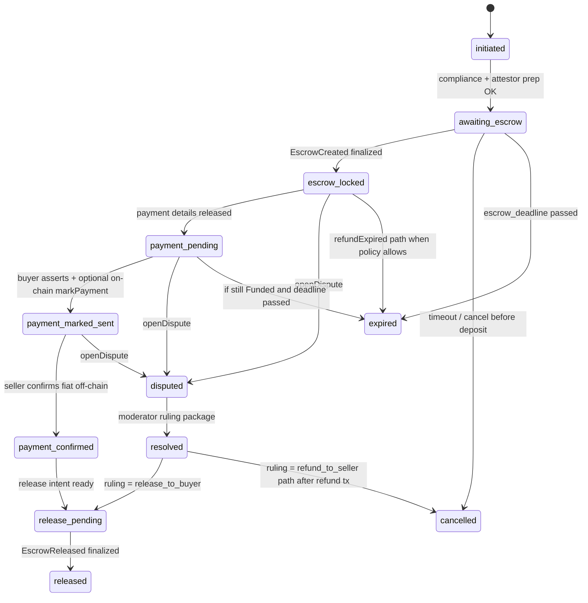

# Verdex Android P2P Module — Mainnet Implementation Specification (APK 1.9.5+)

**Document type:** Enterprise implementation specification (normative)  
**Audience:** Android, backend, contracts, compliance, and moderation engineering  
**Network:** Verdex mainnet only — real VDX  
**Status:** Ready for implementation  
**Supersedes:** Prior generic EscrowVault wording; this document is authoritative for APK 1.9.5+ and must match deployed `VerdexP2PEscrow.sol`, Supabase migration `20260718113000_p2p_kyc_aml_rbac_foundation.sql`, and `MANUAL_KYC_AML_OPERATIONS.md`.

---

## 0. Executive summary

The P2P module lets KYC-cleared users buy and sell **real mainnet VDX** against off-chain fiat, with:

1. **On-chain non-custodial escrow** (`VerdexP2PEscrow`) holding seller VDX.
2. **Off-chain marketplace** (orders, matching, payment instructions, disputes) in private PostgreSQL.
3. **Server-only trade attestation** (`TRADE_ATTESTOR_ROLE`) that authorizes escrow creation without ever holding user keys or customer VDX.
4. **Human moderation + threshold arbitration** for disputes (EIP-712 multi-arbiter signatures).
5. **Launch gate:** only two admin identities may post listings initially, via RBAC/config — no APK fork required to open the market later.
6. **Mining rewards** appear as spendable VDX only after on-chain finality of a claim/distribution, never as mutable points.

**Hard product rule:** The APK must never display testnet balances, mock credits, simulated orders, faucet tokens, or unconfirmed chain state as real VDX.

---

## 1. Non-negotiable architecture principles

| # | Principle | Implication |
|---|-----------|-------------|
| 1 | Chain is balance authority | Wallet VDX and escrow state come from mainnet RPC/indexer finality, not Supabase caches. |
| 2 | Escrow is the contract | Backend coordinates and attests; it never holds user private keys or a hot wallet of customer VDX. |
| 3 | Client is untrusted | APK cannot set KYC, roles, prices after match, escrow state, or reward balances. |
| 4 | Attestor ≠ arbiter ≠ pauser | Separate HSM/MPC key roles; no single key can both authorize trades and seize funds. |
| 5 | Idempotent money paths | Every mutation uses idempotency key + optimistic version + audit event. |
| 6 | No PII on-chain | `tradeReference` is `SHA-256` of private trade material only. |
| 7 | Launch policy is config | `listing_access_mode = explicit_allowlist` today; switchable to `verified_users` later. |
| 8 | Mainnet isolation | Production flavor: fixed chain ID, RPC allowlist, API origin, storage namespace; no network picker. |

---

## 2. System topology



**Trust boundaries**

- APK talks only to: BFF, allowlisted RPC reads, KYC upload grants, FCM.
- Supabase **service role** stays on servers. APK uses user JWT only.
- Clients never receive attestor/arbiter private keys.
- Object storage is private; evidence URLs are 60s, case-scoped, audited.

---

## 3. Alignment with deployed escrow contract

Canonical contract: `contracts/contracts/mainnet/VerdexP2PEscrow.sol`.

### 3.1 On-chain state machine (source of truth for funds)

```text
None
  -> Funded          // createEscrow: seller deposits VDX + valid TRADE_ATTESTOR sig
  -> PaymentMarked   // buyer.markPayment() before paymentDeadline
  -> Released        // seller.release() after PaymentMarked
  -> Refunded        // refundExpired() if still Funded after paymentDeadline
  -> Disputed        // openDispute() from Funded or PaymentMarked
  Disputed -> Released | Refunded  // resolveDispute with quorum ARBITER EIP-712 sigs
```

| Contract state | Off-chain trade status (Supabase) | UI label |
|----------------|-----------------------------------|----------|
| `None` / no escrow | `initiated`, `awaiting_escrow` | Waiting for seller deposit |
| `Funded` | `escrow_locked`, `payment_pending` | VDX locked — pay fiat |
| `PaymentMarked` | `payment_marked_sent` | Buyer marked paid — seller verify |
| `Disputed` | `disputed` | Under review |
| `Released` | `released` | Complete — buyer received VDX |
| `Refunded` | `cancelled` / `expired` / resolved refund | VDX returned to seller |

**Critical:** Off-chain rows may lead the UX, but **terminal fund movement** is only confirmed after indexer finality of `EscrowCreated`, `EscrowReleased`, or `EscrowRefunded`.

### 3.2 Contract API mapping (Android + backend)

| User intent | Who signs tx | Contract call | Backend prerequisite |
|-------------|--------------|---------------|----------------------|
| Lock VDX for trade | **Seller** wallet | `createEscrow(buyer, amount, paymentDeadline, tradeReference, authorizationDeadline, tradeAuthorization)` | Trade row reserved; attestor signs EIP-712 `TradeAuthorization`; seller has allowance |
| Mark fiat sent | **Buyer** wallet | `markPayment(escrowId)` | Off-chain payment assertion + optional proof upload; still Funded; before deadline |
| Release VDX to buyer | **Seller** wallet | `release(escrowId)` | Seller confirms fiat; state PaymentMarked; optional AML clear |
| Timeout refund | Anyone (usually seller) | `refundExpired(escrowId)` | Still Funded; `block.timestamp > paymentDeadline` |
| Open dispute | Buyer or seller | `openDispute(escrowId)` | Creates moderation case; freezes amicable path |
| Resolve dispute | Relayer (system or staff) | `resolveDispute(escrowId, recipient, resolutionNonce, signatureDeadline, signatures[])` | Quorum arbiter EIP-712 sigs from HSM; dual-control moderation ruling |

### 3.3 EIP-712 structures (must match Solidity)

**Domain**

```text
name: "Verdex P2P Escrow"
version: "1"
chainId: <mainnet chain id>
verifyingContract: <VerdexP2PEscrow address>
```

**TradeAuthorization** (signed by `TRADE_ATTESTOR_ROLE`)

```text
TradeAuthorization(
  address seller,
  address buyer,
  uint256 amount,
  uint64 paymentDeadline,
  bytes32 tradeReference,
  uint256 authorizationDeadline
)
```

Constraints enforced on-chain:

- `amount > 0`
- `buyer != seller`, `buyer != 0`
- `paymentDeadline ∈ (now, now + 7 days]`
- `authorizationDeadline ∈ (now, now + 30 minutes]`
- `tradeReference != 0x0`, single-use
- authorization digest single-use

**EscrowResolution** (signed by each `ARBITER_ROLE`)

```text
EscrowResolution(
  bytes32 escrowId,
  address recipient,          // must be buyer or seller
  uint256 resolutionNonce,
  uint256 deadline            // ≤ now + 24h
)
```

Quorum: `arbitrationQuorum` (min 2). Duplicate arbiter sigs rejected.

### 3.4 `tradeReference` construction (off-chain, never PII)

```text
tradeReference = SHA-256(
  "verdex-p2p-v1" ||
  trade_uuid ||
  order_uuid ||
  buyer_user_id ||
  seller_user_id ||
  amount_atomic ||
  fiat_currency ||
  fiat_amount ||
  policy_hash ||
  chain_id ||
  escrow_contract_address
)
```

Store only the hex/bytes32 and the preimage components in private DB. Never put names, emails, bank details, or document IDs in the hash preimage logs that leave the secure zone.

### 3.5 Roles on contract vs product RBAC

| On-chain role | Holds | Product counterpart |
|---------------|-------|---------------------|
| `DEFAULT_ADMIN` / governance multisig + 2-day delay | Timelocked admin | Ops / governance |
| `TRADE_ATTESTOR_ROLE` | HSM keys used by attestor service | Backend only |
| `ARBITER_ROLE` | HSM keys for dispute quorum | Compliance arbiters (not ordinary moderators) |
| `PAUSER_ROLE` | Incident freeze of settlement | Security on-call |
| `UNPAUSER_ROLE` | Resume after review | Governance timelock |
| — | — | `MARKETPLACE_MODERATOR` (off-chain case work only) |
| — | — | `MARKETPLACE_ORDER_CREATOR` / listing grants |

A moderator who reviews chat/payment proof **does not** hold arbiter keys by default. After a dual-approved ruling, a separate arbitration workflow collects quorum signatures.

---

## 4. Android module design (Flutter APK 1.9.5+)

### 4.1 Packages

| Package | Responsibility |
|---------|----------------|
| `feature_wallet` | Mainnet address, balances, send/receive, tx lifecycle UI, allowance management for escrow |
| `feature_marketplace` | Order book, create/edit order (gated), trade room, payment, escrow steps |
| `feature_kyc` | In-house evidence capture per `MANUAL_KYC_AML_OPERATIONS.md` |
| `feature_rewards` | Epoch list, Merkle claim, claim tx tracking |
| `feature_disputes` | Open dispute, evidence upload, status (no staff tools) |
| `core_api` | JWT, mTLS-ready client, idempotency, typed errors, pin |
| `core_chain` | Registry, RPC quorum, ABI decode, finality tracker, contract addresses |
| `core_security` | Keystore, Play Integrity, root risk signal, secure storage, screenshot block on payment details |

Staff moderation is a **separate web console**, never a hidden APK screen.

### 4.2 Client state rules

1. Cache is non-authoritative; label stale snapshots older than N seconds.
2. Tx UI states only: `draft | awaiting_signature | broadcast | seen | confirming | finalized | replaced | failed | dropped`.
3. “Complete” / “VDX received” only after `FINALITY_CONFIRMATIONS`.
4. First mainnet send, first escrow deposit, first claim: irreversible acknowledgment modal with exact amount, fee, to-address, chain name.
5. Seed phrases (if self-custody): shown once, never uploaded, Keystore-encrypted.
6. Payment credentials: shown only after escrow `Funded` finality; screenshot protection; auto-clear from memory on leave.
7. No client-side `isAdmin` email list. Order-create button visibility comes from `GET /v1/marketplace/capabilities`.

### 4.3 Capability probe (launch gate UX)

```http
GET /v1/marketplace/capabilities
Authorization: Bearer <access_token>
```

```json
{
  "p2p_enabled": true,
  "network": "mainnet",
  "asset": "VDX",
  "can_browse_orders": true,
  "can_take_trades": true,
  "can_create_orders": false,
  "order_creation_mode": "explicit_allowlist",
  "kyc": {
    "status": "approved",
    "p2p_eligible": true,
    "tier": "standard",
    "expires_at": "2027-01-01T00:00:00Z"
  },
  "limits": {
    "max_open_trades": 3,
    "max_vdx_per_trade_wei": "5000000000000000000000",
    "daily_vdx_wei": "20000000000000000000000"
  },
  "contracts": {
    "chain_id": 72010,
    "vdx": "0x…",
    "escrow": "0x…",
    "registry_version": 12
  }
}
```

If `can_create_orders=false`, show: “Listing is limited during launch. You can still buy/sell against live offers.” Do not hard-code admin emails in the APK.

---

## 5. Identity, RBAC, and admin-only launch

### 5.1 Product roles (server-side)

| Role / grant | Permissions |
|--------------|-------------|
| `USER` | Browse eligible book; KYC; take trades; upload dispute evidence |
| Listing grant (`verdex_p2p_listing_creator_grants`) | Create/pause/cancel own orders when mode = `explicit_allowlist` |
| Staff `moderator` | Claim cases, request evidence, propose rulings within policy |
| Staff `administrator` | Policy, grants, escalations, dual-control overrides |
| Arbiter (off-app identity bound to on-chain `ARBITER_ROLE`) | Sign dispute resolutions only after approved ruling package |
| Super-admin break-glass | Dual control + hardware key + reason + full audit |

Emails of the two launch admins live **only** in secure identity ops (map email → `auth.users.id` offline), then seed:

```sql
-- Offline, dual-approved ops runbook — never commit emails
INSERT INTO verdex_p2p_listing_creator_grants (user_id, reason_code, granted_by)
VALUES
  ('<admin_user_uuid_1>', 'initial_launch_allowlist', '<granter_uuid>'),
  ('<admin_user_uuid_2>', 'initial_launch_allowlist', '<granter_uuid>');

UPDATE verdex_p2p_platform_policy
SET p2p_enabled = true,
    listing_access_mode = 'explicit_allowlist',
    require_kyc = true,
    require_aml_clear = true,
    version = version + 1,
    updated_by = '<granter_uuid>';
```

### 5.2 Lift gate without architecture change

| Phase | `listing_access_mode` | Who posts orders |
|-------|----------------------|------------------|
| Closed | `disabled` | Nobody |
| Launch | `explicit_allowlist` | Two admin UUIDs only |
| Soft open | `staff_only` or expanded grants | Staff / selected makers |
| Open market | `verified_users` | Any `p2p_eligible` user under limits |

API create-order always evaluates `verdex_current_user_can_create_p2p_listing()`. Changing mode is a versioned policy update + audit event. **No APK release required.**

### 5.3 P2P entitlement predicate (server)

```text
platform.p2p_enabled
AND entitlement.state = eligible
AND (entitlement.expires_at IS NULL OR entitlement.expires_at > now())
AND (NOT require_kyc OR kyc.status = approved AND not expired)
AND (NOT require_aml_clear OR aml.status = clear AND not expired)
AND account not banned/suspended
AND jurisdiction enabled for P2P
```

APK shows only redacted `GET /v1/kyc/me` + capabilities.

---

## 6. Mainnet wallet synchronization

### 6.1 Signed network registry

Ship and update a signed JSON registry:

```json
{
  "registry_version": 12,
  "network": "mainnet",
  "chain_id": 72010,
  "rpc_allowlist": ["https://rpc.verdexswap.site", "https://rpc2…"],
  "explorer_url": "https://explorer.verdexswap.site",
  "finality_confirmations": 12,
  "contracts": {
    "vdx": "0x…",
    "p2p_escrow": "0x…",
    "reward_distributor": "0x…"
  },
  "bytecode_hashes": {
    "p2p_escrow": "0x…"
  },
  "min_app_version": "1.9.5",
  "signature": "…"
}
```

Android verifies signature with pinned release public key before apply. Reject money UI if chainId/RPC/contract mismatch.

### 6.2 Wallet snapshot API

```http
GET /v1/wallets/me/snapshot
```

```json
{
  "chain_id": 72010,
  "address": "0x…",
  "vdx_balance_wei": "…",
  "vdx_balance_display": "123.45",
  "pending_outgoing_wei": "…",
  "escrow_locked_wei": "…",
  "as_of_block": 1844221,
  "finalized_block": 1844209,
  "degraded": false,
  "transactions": [
    {
      "hash": "0x…",
      "type": "escrow_create|escrow_release|escrow_refund|transfer|reward_claim|approve",
      "status": "confirming|finalized|failed",
      "confirmations": 4,
      "amount_wei": "…"
    }
  ]
}
```

### 6.3 Transaction intent + announce flow

1. `POST /v1/wallet/intents` — server validates limits/KYC/trade version; returns unsigned typed payload / calldata quote (never signs user key).
2. User signs in wallet (in-app or external).
3. Client broadcasts to allowlisted RPC.
4. `POST /v1/wallet/transactions/announce` with `{ intent_id, tx_hash }`.
5. Indexer correlates receipt/logs; domain state advances only on matching events + finality.

Replacement txs: match `from + nonce`; supersede prior hash when replacement is seen.

### 6.4 ERC-20 allowance for escrow

Before `createEscrow`, seller must `approve(escrow, amount)` (or exact infinite with explicit risk UI — prefer exact amount). Android shows two-step: Approve → Deposit. Backend verifies allowance ≥ amount via indexer before marking intent ready.

---

## 7. Marketplace domain model

### 7.1 Order sides (aligned with migration enums)

- `sell_vdx`: maker is seller; maker will deposit VDX when a taker buys.
- `buy_vdx`: maker is buyer; taker/seller deposits VDX after accept.

Asset is always `VDX`. Fiat is ISO-4217. Amounts in **atomic wei strings** end-to-end.

### 7.2 Trade creation (reservation)

Serializable transaction:

1. Lock order row `FOR UPDATE` / optimistic `version`.
2. Check `remaining_amount_atomic >= trade_amount` and `>= minimum`.
3. Check both parties entitlement + limits + not self-trade.
4. Decrement `remaining_amount_atomic`; bump order version.
5. Insert trade `initiated` with policy snapshot JSON + `policy_hash`.
6. Insert escrow row `awaiting_deposit`.
7. Append trade event + audit + outbox notifications.
8. Commit; return trade DTO **without** payment instructions.

### 7.3 Off-chain + on-chain dual state machine



**Rules**

- `payment_marked_sent` is an **assertion**, not proof of bank settlement.
- Prefer buyer also calling on-chain `markPayment` so contract state matches; if buyer only marks off-chain, seller release still requires contract `PaymentMarked` — product policy: **require on-chain markPayment** before seller can release.
- Server never sets `escrow_locked`, `released`, terminal refund without indexer event.
- Dispute freezes automatic `refundExpired` handling in the worker until case closes (worker must not call refund while disputed).

### 7.4 Happy path sequence (SELL order, taker buys)

```text
1. Admin creates SELL order (allowlist).
2. Verified user takes trade → trade initiated, amount reserved.
3. Backend builds tradeReference, paymentDeadline, signs TradeAuthorization (HSM).
4. Seller receives escrow-intent: approve + createEscrow calldata + attestor sig.
5. Seller broadcasts createEscrow → indexer → escrow_locked + payment_pending.
6. API reveals encrypted payment instructions to buyer only.
7. Buyer pays fiat off-chain; uploads optional receipt; calls markPayment on-chain.
8. Seller verifies bank/fiat; calls release on-chain.
9. Indexer finalizes EscrowReleased → trade released; order remaining already reduced.
10. Both parties notified; audit complete.
```

### 7.5 BUY order path

Maker is buyer. After take, **seller = taker** deposits via same `createEscrow(seller=msg.sender, buyer=maker)`. Payment instructions belong to maker (buyer). Same escrow machine thereafter.

---

## 8. Database (authoritative tables)

Use existing migration `supabase/migrations/20260718113000_p2p_kyc_aml_rbac_foundation.sql` as baseline. Additional columns/tables below are **additive** for mainnet indexer alignment.

### 8.1 Existing core tables (do not rename)

- `verdex_p2p_platform_policy`
- `verdex_p2p_listing_creator_grants`
- `verdex_p2p_entitlements`
- `verdex_p2p_orders`
- `verdex_p2p_trades`
- `verdex_p2p_escrows`
- `verdex_p2p_trade_events`
- `verdex_p2p_disputes`
- `verdex_p2p_dispute_evidence`
- `verdex_kyc_*`, `verdex_aml_screenings`
- `verdex_staff_roles`
- `verdex_notification_outbox`
- `verdex_api_idempotency_keys`
- `verdex_audit_events` (+ hash chain)

### 8.2 Required additive migration (new file)

```sql
-- 20260718XXXXXX_p2p_mainnet_chain_alignment.sql

ALTER TABLE public.verdex_p2p_escrows
  ADD COLUMN IF NOT EXISTS on_chain_escrow_id TEXT,
  ADD COLUMN IF NOT EXISTS trade_reference_bytes32 TEXT
    CHECK (trade_reference_bytes32 IS NULL OR trade_reference_bytes32 ~ '^0x[0-9a-f]{64}$'),
  ADD COLUMN IF NOT EXISTS seller_address TEXT,
  ADD COLUMN IF NOT EXISTS buyer_address TEXT,
  ADD COLUMN IF NOT EXISTS payment_deadline_unix BIGINT,
  ADD COLUMN IF NOT EXISTS resolution_nonce BIGINT NOT NULL DEFAULT 0,
  ADD COLUMN IF NOT EXISTS on_chain_state TEXT
    CHECK (on_chain_state IS NULL OR on_chain_state IN (
      'none','funded','payment_marked','disputed','released','refunded'
    )),
  ADD COLUMN IF NOT EXISTS deposit_block BIGINT,
  ADD COLUMN IF NOT EXISTS deposit_log_index INTEGER,
  ADD COLUMN IF NOT EXISTS finalized_at TIMESTAMPTZ;

CREATE UNIQUE INDEX IF NOT EXISTS verdex_p2p_escrows_on_chain_id_uidx
  ON public.verdex_p2p_escrows (chain_id, on_chain_escrow_id)
  WHERE on_chain_escrow_id IS NOT NULL;

CREATE UNIQUE INDEX IF NOT EXISTS verdex_p2p_escrows_trade_ref_uidx
  ON public.verdex_p2p_escrows (trade_reference_bytes32)
  WHERE trade_reference_bytes32 IS NOT NULL;

CREATE TABLE IF NOT EXISTS public.verdex_chain_events (
  id UUID PRIMARY KEY DEFAULT gen_random_uuid(),
  chain_id BIGINT NOT NULL,
  tx_hash TEXT NOT NULL,
  log_index INTEGER NOT NULL,
  block_number BIGINT NOT NULL,
  block_hash TEXT NOT NULL,
  contract_address TEXT NOT NULL,
  event_name TEXT NOT NULL,
  payload JSONB NOT NULL DEFAULT '{}'::jsonb,
  finalized_at TIMESTAMPTZ,
  orphaned_at TIMESTAMPTZ,
  created_at TIMESTAMPTZ NOT NULL DEFAULT now(),
  UNIQUE (chain_id, tx_hash, log_index)
);

CREATE TABLE IF NOT EXISTS public.verdex_trade_attestations (
  id UUID PRIMARY KEY DEFAULT gen_random_uuid(),
  trade_id UUID NOT NULL UNIQUE REFERENCES public.verdex_p2p_trades(id),
  attestor_address TEXT NOT NULL,
  authorization_deadline TIMESTAMPTZ NOT NULL,
  payment_deadline TIMESTAMPTZ NOT NULL,
  trade_reference_bytes32 TEXT NOT NULL,
  digest_hex TEXT NOT NULL,
  signature_hex TEXT NOT NULL,
  consumed_on_chain BOOLEAN NOT NULL DEFAULT FALSE,
  consumed_tx_hash TEXT,
  created_at TIMESTAMPTZ NOT NULL DEFAULT now(),
  expires_at TIMESTAMPTZ NOT NULL
);

CREATE TABLE IF NOT EXISTS public.verdex_wallet_accounts (
  id UUID PRIMARY KEY DEFAULT gen_random_uuid(),
  user_id UUID NOT NULL REFERENCES auth.users(id),
  chain_id BIGINT NOT NULL,
  address TEXT NOT NULL,
  custody_type TEXT NOT NULL CHECK (custody_type IN ('self_custody','external_wallet')),
  status TEXT NOT NULL CHECK (status IN ('active','replaced','blocked')),
  created_at TIMESTAMPTZ NOT NULL DEFAULT now(),
  UNIQUE (chain_id, address)
);

CREATE TABLE IF NOT EXISTS public.verdex_reward_epochs (
  epoch_id BIGINT PRIMARY KEY,
  merkle_root TEXT NOT NULL,
  manifest_hash TEXT NOT NULL,
  published_tx_hash TEXT,
  finalized_at TIMESTAMPTZ,
  created_at TIMESTAMPTZ NOT NULL DEFAULT now()
);

CREATE TABLE IF NOT EXISTS public.verdex_reward_claims (
  epoch_id BIGINT NOT NULL REFERENCES public.verdex_reward_epochs(epoch_id),
  user_id UUID NOT NULL REFERENCES auth.users(id),
  wallet_address TEXT NOT NULL,
  amount_wei NUMERIC(78,0) NOT NULL,
  proof JSONB NOT NULL,
  claim_tx_hash TEXT,
  status TEXT NOT NULL CHECK (status IN ('eligible','broadcast','finalized','failed')),
  PRIMARY KEY (epoch_id, user_id)
);
```

### 8.3 Escrow off-chain status vs contract

Keep `verdex_escrow_status` transitions from migration; map:

| After indexer event | `verdex_escrow_status` | `on_chain_state` |
|---------------------|------------------------|------------------|
| intent issued | `awaiting_deposit` | `none` |
| EscrowCreated seen | `deposit_detected` | `funded` |
| EscrowCreated finalized | `locked` | `funded` |
| PaymentMarked | `locked` | `payment_marked` |
| release auth off-chain only | `release_authorized` | `payment_marked` |
| EscrowReleased finalized | `released` | `released` |
| EscrowRefunded finalized | `refunded` | `refunded` |

---

## 9. HTTP API contract (BFF)

### 9.1 Common requirements

- `Authorization: Bearer`
- `X-Idempotency-Key` on all POST/PATCH that mutate
- `X-Trace-Id` echoed
- `X-Device-Id` + integrity token headers
- JSON Schema validation; reject unknown fields on money endpoints
- Error envelope:

```json
{
  "error": {
    "code": "ORDER_CREATION_NOT_ENABLED",
    "message": "Listing is not enabled for your account during launch.",
    "retryable": false,
    "trace_id": "…"
  }
}
```

### 9.2 Endpoint catalog

#### Marketplace

| Method | Path | Authz | Notes |
|--------|------|-------|-------|
| GET | `/v1/marketplace/capabilities` | user | Launch + KYC + limits |
| GET | `/v1/marketplace/orders` | user | Paginated book; no payment secrets |
| GET | `/v1/marketplace/orders/{id}` | user | Public fields + maker reputation tier only |
| POST | `/v1/marketplace/orders` | listing grant + eligible | Create draft/open |
| PATCH | `/v1/marketplace/orders/{id}` | owner + grant | `If-Match: version` |
| POST | `/v1/marketplace/orders/{id}/pause` | owner | Stop new takes |
| POST | `/v1/marketplace/orders/{id}/cancel` | owner | If no reserved amount |
| POST | `/v1/marketplace/trades` | eligible taker | Reserve + create trade |
| GET | `/v1/marketplace/trades/{id}` | party or staff | Role-filtered DTO |
| POST | `/v1/marketplace/trades/{id}/escrow-intent` | seller depositor | Returns approve+createEscrow package |
| POST | `/v1/marketplace/trades/{id}/payment-instructions` | buyer after locked | Decrypt-on-read server side |
| POST | `/v1/marketplace/trades/{id}/payment-sent` | buyer | Off-chain assert + optional proof |
| POST | `/v1/marketplace/trades/{id}/mark-payment-intent` | buyer | Calldata for on-chain markPayment |
| POST | `/v1/marketplace/trades/{id}/confirm-payment` | seller | Off-chain fiat OK |
| POST | `/v1/marketplace/trades/{id}/release-intent` | seller | Calldata for release |
| POST | `/v1/marketplace/trades/{id}/refund-expired-intent` | seller/system | Only if Funded+deadline |
| POST | `/v1/marketplace/trades/{id}/disputes` | party | Opens off-chain + expects openDispute tx |
| POST | `/v1/marketplace/trades/{id}/evidence` | party | Presigned upload after AV ticket |

#### Wallet / chain

| Method | Path | Authz |
|--------|------|-------|
| GET | `/v1/wallets/me/snapshot` | owner |
| POST | `/v1/wallets/me/link` | owner — bind address with signature challenge |
| POST | `/v1/wallet/intents` | owner |
| POST | `/v1/wallet/transactions/announce` | owner |
| GET | `/v1/chain/registry` | authenticated — signed registry |

#### Rewards

| Method | Path | Authz |
|--------|------|-------|
| GET | `/v1/rewards/epochs` | owner |
| POST | `/v1/rewards/{epoch}/claim-intent` | owner |
| POST | `/v1/rewards/claims/announce` | owner |

#### Admin / moderation

| Method | Path | Authz |
|--------|------|-------|
| GET | `/v1/admin/moderation/cases` | moderator |
| POST | `/v1/admin/moderation/cases/{id}/claim` | moderator |
| POST | `/v1/admin/moderation/cases/{id}/propose-ruling` | moderator |
| POST | `/v1/admin/moderation/cases/{id}/approve-ruling` | second staff |
| POST | `/v1/admin/moderation/cases/{id}/arbitration-package` | compliance — builds EIP-712 for arbiters |
| POST | `/v1/admin/moderation/cases/{id}/relay-resolution` | system/staff — submits resolveDispute |
| PATCH | `/v1/admin/marketplace/policy` | administrator dual-control |
| POST | `/v1/admin/marketplace/listing-grants` | administrator dual-control |

### 9.3 Example: create trade

```http
POST /v1/marketplace/trades
X-Idempotency-Key: 8f3c… 
```

```json
{
  "order_id": "uuid",
  "token_amount_atomic": "25000000000000000000",
  "payment_method_code": "BANK_TRANSFER_PK",
  "expected_order_version": 4,
  "taker_wallet_address": "0x…"
}
```

Response `201`:

```json
{
  "trade_id": "uuid",
  "trade_reference": "TRD-…",
  "status": "awaiting_escrow",
  "seller_user_id": "uuid",
  "buyer_user_id": "uuid",
  "token_amount_atomic": "25000000000000000000",
  "fiat_amount": "12500.00",
  "fiat_currency": "PKR",
  "escrow_deadline_at": "2026-07-18T12:30:00Z",
  "payment_deadline_at": "2026-07-19T12:00:00Z",
  "next_action": {
    "actor": "seller",
    "type": "POST_ESCROW_INTENT"
  }
}
```

### 9.4 Example: escrow intent response

```json
{
  "trade_id": "uuid",
  "chain_id": 72010,
  "escrow_contract": "0x…",
  "vdx_contract": "0x…",
  "seller": "0x…",
  "buyer": "0x…",
  "amount_wei": "25000000000000000000",
  "payment_deadline": 1721300000,
  "trade_reference": "0xabc…",
  "authorization_deadline": 1721292000,
  "trade_authorization": "0xsig…",
  "attestor": "0x…",
  "txs": [
    {
      "step": 1,
      "description": "Approve VDX",
      "to": "0xVDX",
      "data": "0x95ea7b…",
      "value": "0"
    },
    {
      "step": 2,
      "description": "Create escrow",
      "to": "0xEscrow",
      "data": "0x…createEscrow…",
      "value": "0"
    }
  ],
  "expires_at": "2026-07-18T12:25:00Z"
}
```

Payment instructions **must not** appear here.

### 9.5 Payment instructions (after Funded finality)

```json
{
  "trade_id": "uuid",
  "payment_method_code": "BANK_TRANSFER_PK",
  "fiat_amount": "12500.00",
  "fiat_currency": "PKR",
  "instructions": {
    "account_name": "…",
    "account_number_masked_display": "****4211",
    "account_number_full": "…",
    "bank_name": "…",
    "reference_code": "VDX-TRD-…"
  },
  "payment_deadline_at": "…",
  "warning": "Only pay the exact amount. Crypto release is manual after seller confirmation."
}
```

Server decrypts `payment_instruction_ciphertext` only for buyer or assigned moderator; every decrypt is audited.

---

## 10. Indexer and finality worker

### 10.1 Responsibilities

1. Subscribe to heads from ≥2 RPC providers; detect reorgs.
2. Index `VerdexP2PEscrow` and VDX Transfer/Approval logs.
3. On `EscrowCreated`: match `tradeReference` → escrow row; set `on_chain_escrow_id`, deposit tx, addresses, amount check (must equal trade).
4. Advance confirmations; at `FINALITY_CONFIRMATIONS` set `finalized_at`, trade → `escrow_locked`/`payment_pending`, release payment instructions outbox.
5. On reorg before finality: mark event `orphaned_at`, roll trade back to `awaiting_escrow` if deposit orphaned; notify parties `CHAIN_REORG`.
6. Never release payment instructions on unfinalized deposit.

### 10.2 Amount safety

If on-chain `amount != trade.token_amount_atomic` or seller/buyer addresses mismatch linked wallets → `failed` + freeze + security alert. Do not auto-release.

### 10.3 Attestation consumption

When `TradeAuthorizationConsumed` seen, mark `verdex_trade_attestations.consumed_on_chain = true`. Expired unused attestations are invalidated; seller must request a fresh escrow-intent.

---

## 11. KYC / AML integration (P2P gate only)

Normative KYC UX/ops: `ANDROID_KYC_AML_MAINNET_SPEC.md` + `MANUAL_KYC_AML_OPERATIONS.md`.

P2P-specific hooks:

| Moment | Check |
|--------|-------|
| Create order | Eligible + listing grant + KYC/AML |
| Take trade | Both parties eligible; counterparty limits; wallet screening |
| Escrow intent | Fresh AML wallet screen on seller+buyer addresses |
| Release intent | No AML_HOLD on either party; dispute not open |
| Dispute open | Preserve entitlement; stop new trades if account risk high |

Sanctions/PEP potential match → `AML_HOLD` entitlement suspend; in-flight escrow goes to compliance dispute path; **no unilateral seize**.

---

## 12. Mining reward distribution → real VDX

P2P and wallet must treat rewards as:

```text
mining_work_event (append-only)
  -> epoch close job (anti-fraud)
  -> merkle root publish (multisig/timelock)
  -> indexer finality
  -> user claim tx
  -> VDX balance in snapshot
```

**Forbidden**

- Crediting `vp_balance_cached` as spendable VDX
- API that “sends” VDX from a validator hot key to users for mining
- Client-reported hashrate as payout multiplier without server challenges

Claim intent returns Merkle proof + `claim` calldata; announce + finality required before UI shows “claimed”.

---

## 13. Notifications

Transactional outbox only (`verdex_notification_outbox`).

| Event | Channels | Payload rules |
|-------|----------|---------------|
| Order opened/paused | push, in-app | No PII |
| Trade created | both parties | trade ref only |
| Escrow funded finalized | buyer | “Pay within deadline” |
| Payment marked | seller | No bank details in push |
| Released / refunded | both | amounts OK as display strings from server |
| Dispute opened/SLA | both + staff | case id |
| KYC decision | email + push | no document data |
| AML hold | in-app + email | generic compliance wording |
| Reward epoch | push | epoch id |
| Reorg | both | “Open app to refresh status” |

Dedupe key example: `escrow-funded:{trade_id}:{tx_hash}`.

---

## 14. Human moderation procedures

### 14.1 Case queues

`payment_not_received`, `wrong_amount`, `chargeback_risk`, `account_takeover`, `AML_HOLD`, `technical_escrow_issue`, `policy_violation`, `duplicate_identity`.

### 14.2 Moderator console (web)

Immutable timeline per trade:

- Order version + policy hash  
- Trade events  
- On-chain escrow id, states, tx hashes, finality  
- Redacted chat / payment proofs (signed URL, access logged)  
- KYC tier (not raw docs unless compliance role)  
- Risk alerts  
- Staff actions  

### 14.3 Decision workflow (four-eyes + on-chain quorum)

```text
1. Party opens dispute (off-chain API) AND submits openDispute tx (or server detects DisputeOpened).
2. Moderator claims case; verifies Funded/PaymentMarked on-chain.
3. Evidence window (config SLA).
4. Moderator proposes ruling: release_to_buyer | refund_to_seller | escalate.
5. Second independent approver confirms if above VDX threshold, AML, or staff-involved.
6. System builds EscrowResolution EIP-712 package (escrowId, recipient, resolutionNonce, deadline).
7. Distinct ARBITER_ROLE HSM keys sign until quorum.
8. Relayer calls resolveDispute; indexer finalizes; case closed.
9. Appeals = new case; original audit immutable.
```

**Moderator cannot** press a button that moves VDX without quorum signatures.  
**Admin cannot** bypass escrow with a DB update.

### 14.4 SLA (configuration)

| Class | Ack | Target decision |
|-------|-----|-----------------|
| AML / ATO | 15 min | Policy window |
| Payment dispute standard | 4 h | Published policy |
| Technical escrow | 1 h | 24 h |

---

## 15. Security controls

### 15.1 Mobile

- Play App Signing; publish cert SHA-256  
- TLS 1.2+; cert pinning + backup pins  
- Play Integrity as **risk signal**, not sole lock  
- Keystore hardware-backed keys where available  
- No service-role keys, attestor keys, or RPC write keys in APK  
- R8/obfuscation; tamper telemetry  
- Screen capture block on payment instruction screens  

### 15.2 API

- OAuth/OIDC PKCE; short access tokens; refresh rotation + family reuse detection  
- Device binding; step-up for listing grant changes and high-value trades  
- Schema validation; body size limits  
- Redis rate limits: IP / user / device / endpoint  
- Idempotency 24h store  

### 15.3 Keys

| Key | Storage | Operators |
|-----|---------|-----------|
| Trade attestor | HSM/MPC, dual control | Backend signing service |
| Arbiters (n≥3, quorum≥2) | Separate HSM partitions | Compliance ceremony |
| Pauser | Security on-call | Incident |
| Unpauser | Governance timelock | Multisig |
| DB encryption / object DEKs | Cloud KMS CMK | Platform |
| Registry signing | Offline release key | Release eng |

Compromise runbook: pause escrow, rotate attestors/arbiters via governance, invalidate outstanding authorizations, force re-auth sessions.

### 15.4 Data protection

- Field encryption for payment instructions and KYC notes  
- Evidence outside primary DB  
- IP/UA stored as keyed HMAC only  
- Retention + legal hold  
- Append-only audit hash chain (`verdex_record_audit_event`)  

---

## 16. Failure scenarios and required behavior

| Failure | Behavior |
|---------|----------|
| RPC quorum disagreement | Freeze new money intents; show degraded banner; keep drafts |
| Reorg before finality | Orphan events; roll unfinalized escrow; notify; never release instructions on orphaned deposit |
| createEscrow broadcast not indexed | Stay `awaiting_escrow`/`broadcast`; poll hash+nonce; support ticket after T+N |
| Attestation expired before user signs | `ATTESTATION_EXPIRED`; new escrow-intent |
| Double take / concurrent reserve | One wins version check; other `ORDER_AMOUNT_CHANGED` |
| Buyer lies about payment | Seller does not release; dispute; arbiters decide |
| Seller ghosts after PaymentMarked | Buyer disputes; cannot refundExpired (not Funded); arbitration |
| Buyer never pays, never marks | After deadline, refundExpired while Funded |
| Duplicate idempotency different body | `409 IDEMPOTENCY_KEY_REUSE` |
| KYC provider/ops backlog | No new high-risk takes if policy requires fresh screen; existing verified OK |
| Moderator key / arbiter compromise | Pause resolveDispute path; rotate; audit pending packages |
| APK tampering | Session revoke + step-up; funds remain in escrow/contract under user keys |
| Indexer lag | Chain authoritative; delay notifications; expose trace_id |
| Partial fill race | Order remaining enforced in serializable tx only |
| Wrong chain ID in client | Reject all intents; force registry refresh |

---

## 17. Observability

**Metrics:** API latency/error by route, idempotency conflicts, order book depth, trade state dwell histograms, escrow deposit→finality lag, reorg count, dispute rate, SLA breach, attestor sign latency, arbiter package age, reward root/claim mismatch, notification dead-letter.

**Tracing:** Every money action correlates `trace_id`, `trade_id`, `escrow_id`/`on_chain_escrow_id`, `tx_hash`, `idempotency_key_hash`, `audit_sequence`.

**Alerts:** Unauthorized admin API, listing grant changes, policy version bumps, failed attestor, quorum sign stall, finality deadlock, unusual reward root, pause invoked.

---

## 18. Android UI flows (normative screens)

### 18.1 Marketplace home

- Network badge: **MAINNET · Real VDX** (non-dismissible on P2P root)  
- Tabs: Buy VDX / Sell VDX  
- Filters: currency, payment method, amount  
- CTA Create offer: hidden or disabled with reason if `can_create_orders=false`  

### 18.2 Trade room stepper

```text
1. Matched
2. Lock VDX (seller)
3. Pay fiat (buyer)
4. Confirm & release (seller)
5. Done
```

Each step shows on-chain status subtext: `Waiting for 12 confirmations…`.

### 18.3 Copy rules

Allowed: “Mainnet VDX”, “Escrowed on Verdex chain”, “Irreversible after release”.  
Forbidden: “Test coins”, “Demo balance”, “Points equal VDX”, “Instant guaranteed bank settlement”.

---

## 19. Test plan (implementation gates)

### 19.1 Contract tests

- Happy path create → mark → release  
- refundExpired only from Funded after deadline  
- markPayment after deadline reverts  
- openDispute from Funded/PaymentMarked  
- resolveDispute quorum, duplicate sigs, wrong recipient, nonce  
- pause blocks settlement but allows openDispute  
- trade auth replay / bad attestor / expired auth  
- fee-on-transfer token behavior rejected  

### 19.2 API / DB tests

- Allowlist: only two grants can POST orders  
- Mode flip to `verified_users` without code change  
- Concurrent takes on last remaining amount  
- Idempotent trade create  
- Payment instructions 403 before finality  
- Entitlement revoke mid-flight  
- Audit chain integrity  

### 19.3 Android E2E (mainnet staging chain)

- Full sell trade with two devices  
- Kill app mid-broadcast; recover via announce  
- Airplane mode + resume  
- Deep link notification opens trade requiring re-fetch  
- Rooted device risk path  

### 19.4 Chaos

- Reorg simulated deposit  
- Attestor HSM timeout  
- Indexer down  
- FCM failure with outbox retry  

---

## 20. Delivery checklist before enabling `p2p_enabled`

1. Deploy and verify `VerdexMainnetVDX` + `VerdexP2PEscrow` with multisig roles set.  
2. Attestor and ≥3 arbiters in HSM; quorum ≥2; runbooks signed.  
3. Apply Supabase foundation + chain alignment migrations; RLS verified.  
4. Seed exactly two listing grants via offline dual control (no emails in git).  
5. Indexer dual-RPC + reorg tests green.  
6. KYC ops staffed; moderation SLAs published.  
7. External audit of escrow + authz + mobile wallet path.  
8. Pen-test: privilege escalation, IDOR on trades, evidence URL leak, attestor abuse.  
9. Kill switches: `p2p_enabled=false`, pause contract, disable new trades flag.  
10. Status page + on-call.  
11. APK 1.9.5+ min version enforced by registry and Play.  
12. Open with allowlist only; metrics review before `verified_users`.

---

## 21. Definition of done

The P2P module is complete when:

1. A KYC-cleared non-admin user **cannot** create orders under `explicit_allowlist` but **can** complete a take against an admin order.  
2. Seller deposit, buyer `markPayment`, seller `release` all finalize on mainnet and match DB + wallet snapshot.  
3. Dispute path produces quorum-signed `resolveDispute` and correct recipient balance.  
4. Expired unpaid Funded escrow refunds via `refundExpired` only.  
5. No client path mints, edits, or mislabels real VDX.  
6. Switching `listing_access_mode` to `verified_users` requires only audited policy change.  
7. Mining rewards appear as VDX only after claim finality.  
8. Full audit hash chain exists for every privilege and settlement action.

---

## 22. Document control

| Version | Date | Notes |
|---------|------|-------|
| 2.0.0 | 2026-07-18 | Rewritten for APK 1.9.5+; aligned to `VerdexP2PEscrow.sol` + Supabase RBAC foundation + in-house KYC ops. Mainnet-only real VDX. |
| 2.1.0 | 2026-07-20 | **Backend production fix.** Root-caused and fixed the "null initiated" APK bug (attestation fields were returned in the HTTP response but never persisted — now stored on the escrow row via migration `20260720120000`). Replaced the read-then-write trade-opening sequence with an atomic `verdex_p2p_open_trade` RPC (locks the order `FOR UPDATE`, eliminates over-allocation race). Removed all placeholder values: no fake `0x0000…0000` wallet fallbacks, no hardcoded sandbox attestor key (`0x0123…` is now in a `COMPROMISED_ATTESTOR_KEYS` blocklist). Implemented the full trade state machine matching the DB transition trigger (`initiated → awaiting_escrow → escrow_locked → payment_pending → payment_marked_sent → payment_confirmed → release_pending → released`). Added: per-transition `verdex_p2p_trade_events` logging, `verdex_notification_outbox` writes to the counterparty on every transition, `X-Idempotency-Key` support on every mutation, rate limiting on every mutation, buyer/seller-scoped authorization on every update (closes the `closeTrade`/`report` authz holes where any user could mutate any trade), self-trade prevention, BigInt atomic-amount math (no float precision loss), structured JSON logging with trace IDs, and a `verdex_restore_order_remaining` RPC for cancel/expiry refunds. Added `TRADE_ATTESTOR_PRIVATE_KEY` to `.env.example`. 22 unit tests added (`api/_p2p/handler.test.js`, `npm run test:p2p`) including an EIP-712 round-trip test that verifies the handler's `signTradeAuthorization` digest recovers to the attestor address the contract expects. `VerdexP2PEscrow.sol` unchanged — passed audit (ReentrancyGuard, role-based authz, terminal-state double-release prevention, balance-before/after check all present). |

**Related normative docs**

- `ANDROID_KYC_AML_MAINNET_SPEC.md`  
- `MANUAL_KYC_AML_OPERATIONS.md`  
- `contracts/contracts/mainnet/VerdexP2PEscrow.sol`  
- `supabase/migrations/20260718113000_p2p_kyc_aml_rbac_foundation.sql`  
- `supabase/migrations/20260720120000_p2p_attestation_persistence_and_atomic_open.sql`  
- `MINING_ARCHITECTURE.md` (reward challenges; must not contradict §12)

---

*End of specification.*
