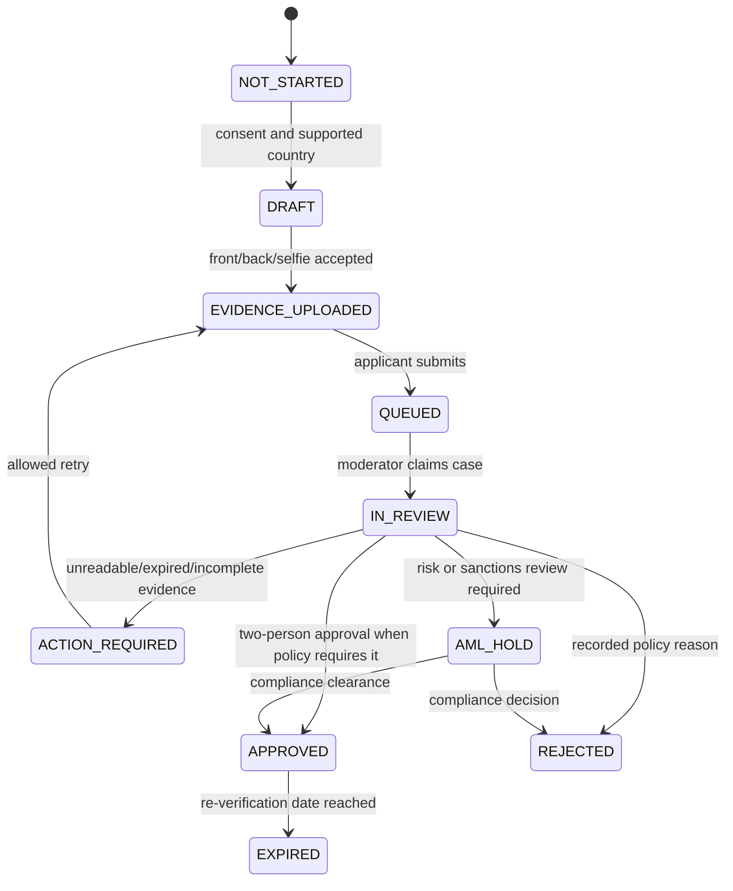

# Verdex in-house KYC/AML operations

## Purpose and boundary

Verdex, not an automated identity vendor, is the verification operator. Human
moderators review the applicant's document images and live-selfie evidence and
make the approval decision. This is an operational design, not legal advice;
launch jurisdictions, retention periods, identity standards, sanctions process,
and reporting obligations must be approved by qualified local counsel before
opening P2P.

The KYC system may grant P2P access only. It cannot mint VDX, release escrow,
or modify a wallet balance. No document, selfie, name, address, bank detail,
or government identifier is sent to the chain or stored in `tradeReference`.

## Capture and private storage

1. The Android app authenticates the account and asks the API for a five-minute,
   single-use upload grant for `document-front`, `document-back` when required,
   and `live-selfie`.
2. The private upload service accepts only `image/jpeg`, `image/png`, or an
   approved short live-capture format; it enforces size, pixel, checksum and
   malware-scan limits, strips EXIF, and stores a content hash. Gallery import
   is disabled by default.
3. Evidence is written to a private `kyc-evidence` bucket. There is no public
   URL. Access uses an authenticated, case-scoped signed URL with a 60-second
   expiry, issued only to the applicant or a moderator assigned to that case.
4. Encrypt in transit (TLS 1.3) and at rest with a cloud KMS key. A production
   deployment must use envelope encryption: a per-object data-encryption key
   wrapped by a KMS customer-managed key. Store the object key, KMS key version,
   SHA-256 digest and retention deadline as metadata; never log image bytes.
5. The app keeps a captured file only in encrypted application storage until an
   upload receipt arrives, then securely deletes it. Crash reporting, analytics,
   push notifications and normal server logs must contain only a case ID and a
   redacted error class.

Human review of a static selfie cannot prove liveness by itself. The app must
record a fresh, short active challenge (random head-turn / blink sequence) and
store the challenge completion result with the capture; a reviewer verifies that
result and the face/document match. Any unclear result is `manual_review` or
`action_required`, never auto-approved.

## Case state and permissions



| Role | May do | May not do |
|---|---|---|
| Applicant | Submit/retry own evidence, read redacted status | View moderator notes; set approval |
| Moderator | Claim a case, view assigned evidence, score document/selfie, request resubmission | Approve own high-risk case; change P2P escrow |
| Compliance lead | Clear AML hold, make second approval/rejection, export legal audit package | Change validator or treasury controls |
| Administrator | Configure country/policy/roles and retention rules | Read evidence by default; settle P2P escrow |
| Escrow arbiter | Sign a dispute decision from evidence in the P2P case | Read unrelated KYC cases or self-approve KYC |

For normal-risk cases one moderator and one compliance lead approve. High-risk,
document mismatch, duplicate identity, or large P2P-limit cases require two
different reviewers plus the compliance lead. A moderator cannot review their
own case, cannot approve a case they created, and cannot edit a final decision;
corrections create a new versioned decision.

## Database model (private PostgreSQL)

```sql
create type kyc_case_status as enum (
  'NOT_STARTED','DRAFT','EVIDENCE_UPLOADED','QUEUED','IN_REVIEW',
  'ACTION_REQUIRED','AML_HOLD','APPROVED','REJECTED','EXPIRED'
);

create table kyc_cases (
  id uuid primary key,
  account_id uuid not null,
  status kyc_case_status not null,
  policy_version text not null,
  country_code char(2) not null,
  submitted_at timestamptz,
  approved_at timestamptz,
  expires_at timestamptz,
  risk_score smallint,
  version integer not null default 1,
  created_at timestamptz not null default now(),
  updated_at timestamptz not null default now()
);

create table kyc_evidence (
  id uuid primary key,
  case_id uuid not null references kyc_cases(id),
  kind text not null check (kind in ('document_front','document_back','live_selfie')),
  object_key text not null unique,
  sha256 char(64) not null,
  kms_key_version text not null,
  upload_state text not null check (upload_state in ('accepted','quarantined','deleted')),
  retention_delete_after timestamptz not null,
  created_at timestamptz not null default now()
);

create table kyc_decisions (
  id uuid primary key,
  case_id uuid not null references kyc_cases(id),
  decision text not null check (decision in ('approve','reject','request_resubmission','aml_hold')),
  document_score smallint check (document_score between 0 and 100),
  face_match_score smallint check (face_match_score between 0 and 100),
  liveness_score smallint check (liveness_score between 0 and 100),
  reviewer_id uuid not null,
  reason_code text not null,
  notes_ciphertext bytea,
  created_at timestamptz not null default now()
);

create table kyc_audit_events (
  id uuid primary key,
  case_id uuid not null references kyc_cases(id),
  actor_id uuid,
  actor_role text not null,
  event_type text not null,
  previous_hash char(64),
  event_hash char(64) not null,
  metadata jsonb not null default '{}',
  created_at timestamptz not null default now()
);
```

Enable row-level security. Applicants can select only their redacted case and
write only a draft/submission. Moderators receive case-scoped evidence access
through server-issued signed URLs after role, MFA, assignment, and audit checks.
Direct bucket reads, SQL-editor use, service-role keys in an APK, and evidence
URLs in database exports are prohibited.

## API contract

| Endpoint | Authorization | Effect |
|---|---|---|
| `POST /v1/kyc/cases` | authenticated applicant + idempotency key | Creates draft and policy snapshot |
| `POST /v1/kyc/cases/{id}/uploads` | case owner | Returns one-time upload grant; records evidence digest on completion |
| `POST /v1/kyc/cases/{id}/submit` | case owner | Moves a complete case to `QUEUED` |
| `GET /v1/kyc/me` | case owner | Returns redacted status, expiry and P2P entitlement |
| `GET /v1/admin/kyc/queue` | moderator MFA | Returns assignment-safe review queue, never public URLs |
| `POST /v1/admin/kyc/{id}/claim` | moderator MFA | Atomically claims an unassigned case |
| `POST /v1/admin/kyc/{id}/decision` | moderator/compliance MFA | Appends immutable versioned decision and triggers maker/checker logic |
| `POST /v1/admin/kyc/{id}/evidence-url` | assigned reviewer MFA | Issues one 60-second private evidence URL and audits access |

All write endpoints require an idempotency key, optimistic case version, CSRF
defence for browser sessions, rate limits, device/IP risk telemetry stored as
keyed hashes, and an immutable audit event. Successful final approval performs
one transaction: update `kyc_cases`, create a P2P entitlement with policy and
expiry, append an audit event, and write an email outbox event. The worker sends
the confirmation email after commit. If sending fails, access remains correct and
the outbox retries; the API never reports an email failure as a KYC rejection.

## AML procedure

The compliance team manually checks identity against the legally required
sanctions, PEP, adverse-media, duplicate-account and source-of-funds policies
for the user's jurisdiction. Store the policy version, search timestamp,
reviewer, result category and evidence reference—not full watchlist data—in the
case audit trail. A potential match creates `AML_HOLD`; only a compliance lead
can clear or reject it. Do not advertise AML coverage, payment limits, or
available jurisdictions until legal policy has approved them.

## P2P gate and incident handling

The P2P backend must calculate eligibility server-side as:

```text
case.status == APPROVED
AND case.expires_at > now
AND no active AML_HOLD
AND account is not suspended
AND country/policy allows P2P
```

When these checks pass, a hardware-backed `TRADE_ATTESTOR_ROLE` key signs the
exact seller wallet, buyer wallet, VDX amount, payment deadline, private trade
reference hash, and short authorization deadline in the escrow's EIP-712 domain.
The contract consumes that authorization once. An attestor can authorize a
verified trade but cannot release, refund, or seize escrowed VDX.

At the first credible fraud or account-takeover signal, suspend new listings and
new escrow creation for the account, preserve the audit chain, and route active
`PaymentMarked` escrows to the threshold-arbiter dispute procedure. Do not
unilaterally seize or release an escrow. Follow the applicable legal escalation
and retention process.
