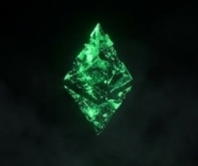
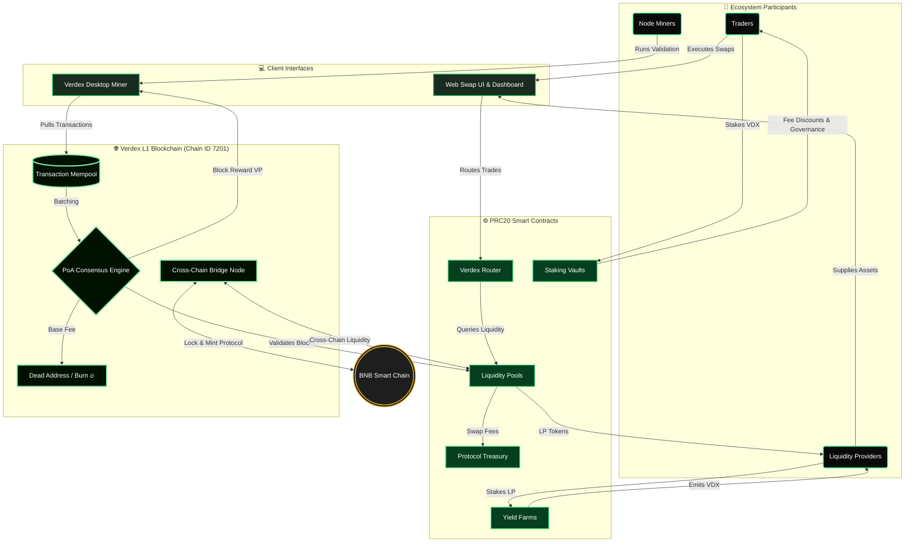
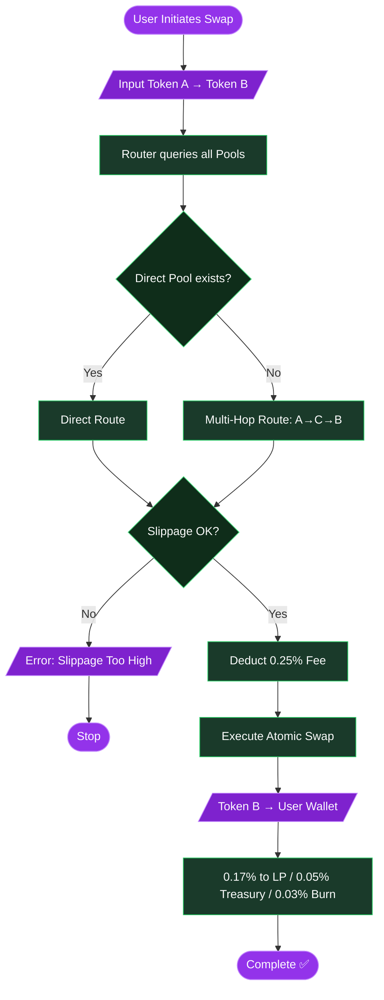
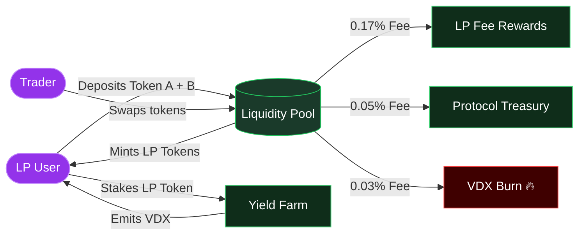
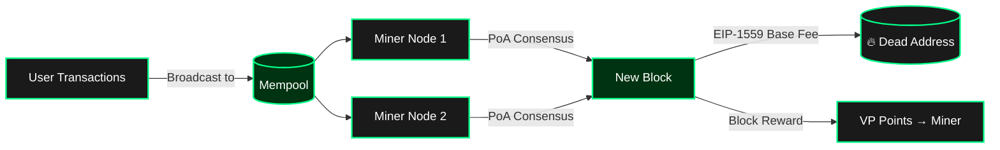
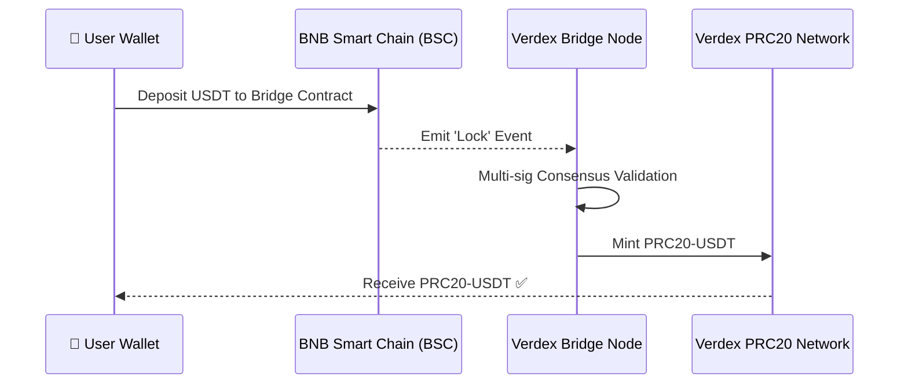
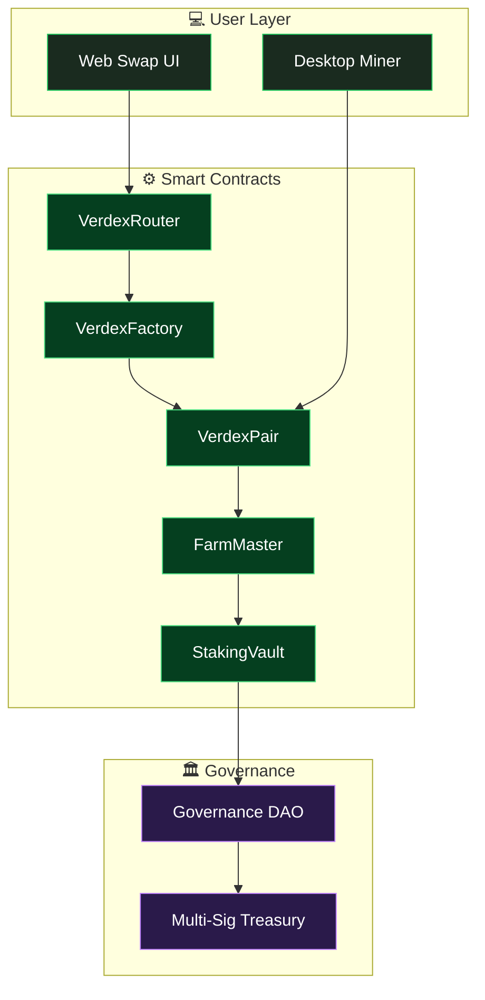
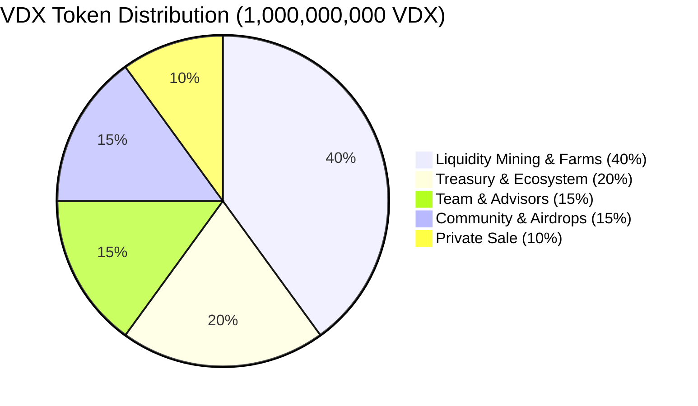

  
  
  # Verdex Ecosystem (PRC20 Protocol)
  
  **Swap Smart. Grow Green.**
  
  
  
  
  
  
  

---

## 🌍 What is Verdex?

Verdex is a next-generation, fully decentralized exchange (DEX) and complete DeFi ecosystem built on the proprietary **PRC20 standard**. Designed to rival the BNB Smart Chain (BSC) and Ethereum, the network is hyper-optimized for speed, extremely low fees, and environmental sustainability.

At its core, Verdex is:
- 🔗 A **custom Layer-1 Proof-of-Authority blockchain** (Chain ID: 7201)
- ⚙️ A **complete PRC20 token standard** (like BEP20 for BNB, but for Verdex)
- 🔄 A **decentralized AMM exchange** (Swap, Pool, Farm, Stake)
- 🖥️ A **Desktop Mining Network** (DePIN) where anyone can earn Verdex Points (VP)
- 🌉 A **cross-chain bridge** designed to interoperate with the BNB Smart Chain

---

## 🗺️ Full Ecosystem Architecture

---

## 🔄 How a Swap Works (Transaction Lifecycle)

---

## 💧 How Liquidity & Farming Works

---

## ⛏️ How Desktop Mining (DePIN) Works

---

## 🌉 BNB Smart Chain Cross-Chain Bridge

---

## 🏛️ Smart Contract Architecture

---

## 📊 VDX Token Distribution

---

## 🗓️ Roadmap

| Phase | Milestone | Status |
|-------|-----------|--------|
| ✅ Phase 1 | Brand, website, whitepaper, community channels | **Completed** |
| 🔄 Phase 2 | PRC20 Testnet (Chain ID 7201), Desktop Miner, VP Mining, Explorer | **In Progress** |
| 📅 Phase 3 | VDX Token Generation Event, Exchange Listings — **Dec 12, 2026** | Upcoming |
| 🚀 Phase 4 | Mainnet launch, DAO governance, multi-chain expansion | Upcoming |
| 🌐 Phase 5 | Perpetuals, lending, institutional APIs | Future |

---

## 🌐 Official Links

| Resource | Link |
|----------|------|
| 🌍 Website | [verdexswap.site](https://verdexswap.site) |
| 📄 Whitepaper (Read Online) | [verdexswap.site/whitepaper.html](https://verdexswap.site/whitepaper.html) |
| ⛏️ Mining Dashboard | [verdexswap.site/dashboard.html](https://verdexswap.site/dashboard.html) |
| 📬 Contact | verdexchainsuppourt@gmail.com |
| 💬 Telegram | [@VerdixOffical](https://t.me/VerdixOffical) |
| 🎵 TikTok | [@blockchaindevolper](https://tiktok.com/@blockchaindevolper) |

---

  <b>Building the greenest, fastest DeFi ecosystem in Web3.</b> 
  <i>Developed by Suleman — Other contributors to be announced.</i>

