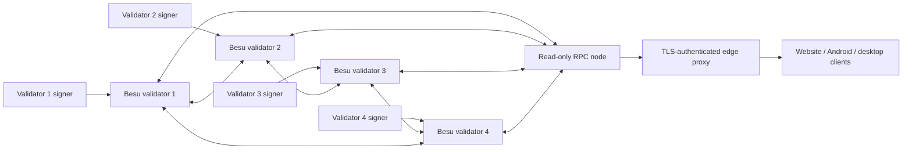

# Verdex Windows QBFT Implementation Plan

Status: executable implementation plan for a Windows 11 Besu QBFT rehearsal.
It is not a mainnet launch authorization. The whitepaper-derived network profile
uses proposed chain ID `72010` and requires a final registry check at the
genesis ceremony.

## Operating model

Four validators run QBFT and one separate node serves loopback-only JSON-RPC,
WebSocket, and Prometheus metrics. Each validator must be operated in a distinct
administrative domain for real mainnet use. A single Windows workstation may run
all five nodes only as a local rehearsal; it is not independent validator
operation.



## Phase 1 - automated workstation bootstrap

Run these commands from the repository root in a normal Windows PowerShell
window. They install Java 21, install the current Java runtime Besu requires,
download the official ZIP, verify its published SHA-256, create user-level
environment variables, and create the project folders.

```powershell
Set-ExecutionPolicy -Scope Process Bypass
& .\mainnet\windows\Install-VerdexBesuToolchain.ps1
& .\mainnet\windows\Initialize-VerdexBesuProject.ps1
& .\mainnet\windows\Test-VerdexBesuToolchain.ps1
```

Acceptance: the verifier reports Java 21, the Besu Java runtime, Besu version,
and `SCAFFOLDED_NOT_CONFIGURED_NOT_SIGNED_NOT_DEPLOYED`.

## Phase 2 - validator operator ceremony

This is deliberately not automated by the repository. Each of the four
operators creates and retains a protected signer independently, preferably an
HSM or remote signer. Private keys, seed phrases, and recovery material must
never be copied into the repository, the `C:\Verdex\besu-qbft` project tree,
email, chat, website, APK, or desktop app.

Each operator supplies only these public values to the release board:

| Required public value | Purpose |
|---|---|
| Validator EVM address | Committed into QBFT genesis |
| Node public key / enode ID | Static peer and bootnode identity |
| Stable IP or DNS name and P2P port | Reachable P2P endpoint |
| Operator attestation | Confirms independent key custody |

For a local rehearsal, use the same machine's `127.0.0.1` with ports
30303-30306. For production, use stable public/private network addresses and
firewall rules appropriate to each host; do not place bootnodes behind a load
balancer.

## Phase 3 - public deployment inputs

Copy the template to the ignored, operator-controlled deployment input file:

```powershell
Copy-Item `
  C:\Verdex\besu-qbft\network\inputs\DEPLOYMENT_INPUTS.template.json `
  C:\Verdex\besu-qbft\network\inputs\DEPLOYMENT_INPUTS.json
```

Fill the following exact values in `DEPLOYMENT_INPUTS.json`:

- four distinct validator public addresses;
- four distinct enode URLs with reachable host/IP and port;
- a timestamp at least five minutes in the future;
- two distinct public native-gas recipients: treasury and one-time deployer;
- the final public RPC hostname and edge-rate-limit owner.

Do not place a private key in this JSON file. Its validation permits only public
values and fails closed on placeholders, duplicate validators, duplicate
bootnodes, chain ID 7201, invalid Besu distribution pins, invalid timing, or
missing native-gas allocations.

## Phase 4 - deterministic network build

```powershell
& .\mainnet\windows\Build-VerdexQbftConfig.ps1
```

The command generates the unsigned genesis, static peer list, node permission
configuration, non-validator RPC config, and unique on-machine ports. It does
not start a node, create a key, deploy a contract, or overwrite an existing
release configuration.

Acceptance: compare the `genesis.json` SHA-256 and the four validator public
addresses across all operators before any node starts.

## Phase 5 - local five-node rehearsal

An operator runs the launcher while retaining the four local key paths. The
paths are consumed locally by Besu and are not printed by the script.

```powershell
& .\mainnet\windows\Start-VerdexNetwork.ps1 `
  -ValidatorKeyFiles @(
    'D:\Verdex-operator-1\validator.key',
    'D:\Verdex-operator-2\validator.key',
    'D:\Verdex-operator-3\validator.key',
    'D:\Verdex-operator-4\validator.key'
  )

& .\mainnet\windows\Test-VerdexNetwork.ps1
```

The health check requires chain/network ID 72010, four peers at the RPC node,
new blocks in 12 seconds, and Prometheus responses on ports 9545-9549.

To stop or restart only the recorded Besu processes:

```powershell
& .\mainnet\windows\Stop-VerdexNetwork.ps1
& .\mainnet\windows\Restart-VerdexNetwork.ps1 -ValidatorKeyFiles @('D:\Verdex-operator-1\validator.key','D:\Verdex-operator-2\validator.key','D:\Verdex-operator-3\validator.key','D:\Verdex-operator-4\validator.key')
```

Acceptance: repeat stop/start, validate no data directory is shared, and keep
all per-node logs under `C:\Verdex\besu-qbft\nodes\<node>\logs`.

## Phase 6 - production topology

Move the four validators to four separately administered Windows hosts before
any public launch. Each host runs one validator and exposes only its configured
TCP/UDP P2P port to the other allowlisted nodes. Metrics remain loopback-only
and are collected through an authenticated monitoring agent. The RPC host is a
non-validator machine: HTTP 8545 and WebSocket 8546 remain bound to loopback
and are published only through a TLS, authentication, rate-limited edge proxy.

Acceptance: firewall review, static-node reconnect test, host recovery test,
time synchronization test, restore rehearsal, and independent operator signoff.

## Phase 7 - mainnet release gates

The local network remains a rehearsal until all of these are public and signed:

- final chain ID and block-zero/genesis hash;
- four independently operated validator public addresses and real endpoints;
- Safe address, owners, and threshold;
- VDX, escrow, reward-distributor, and governance deployment receipts plus
  runtime-code hashes;
- two independent audit reports with remediation signoff;
- legal and KYC/AML operational approval;
- production RPC health and explorer indexing evidence.

Only then can the website, Android APK, and desktop EXE switch from
`MAINNET_NOT_READY` to the verified network configuration.
