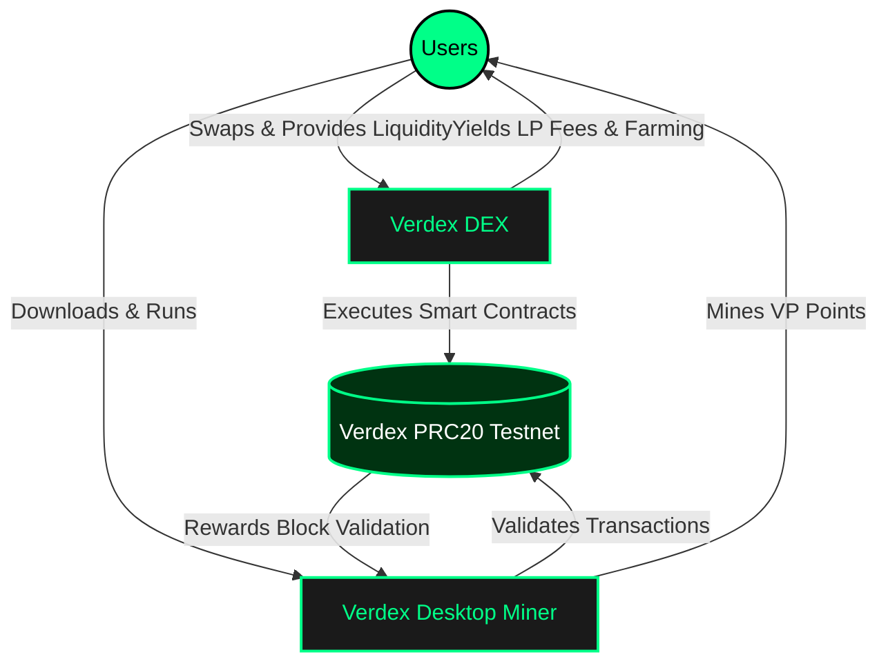
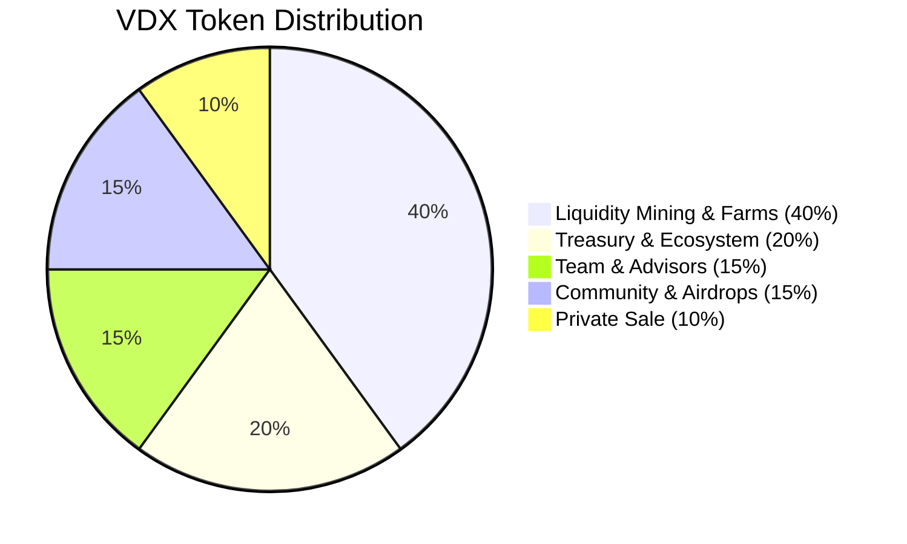
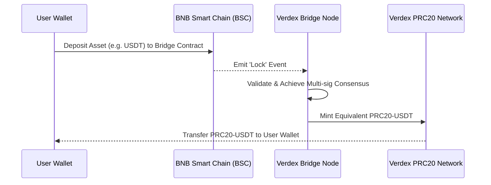
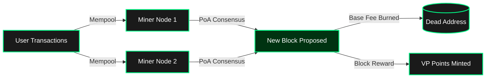

# Verdex Whitepaper
## Version 1.0 | July 2026

---

## Abstract

Verdex is a next-generation decentralized exchange (DEX) and DeFi ecosystem engineered to deliver institutional-grade liquidity infrastructure with consumer-grade simplicity. Inspired by the proven Automated Market Maker (AMM) models of Uniswap and PancakeSwap, Verdex introduces a vertically integrated suite of products — Swap, Pool, Farm, and Stake — governed by the VERDEX (VDX) token. The protocol is designed to maximize capital efficiency, minimize slippage, and align long-term incentives among traders, liquidity providers, and governance participants through sustainable tokenomics and transparent on-chain mechanics.

This document presents the complete architecture, economic model, infrastructure stack, product logic, and strategic roadmap of Verdex. The protocol is currently under active development; token issuance and live swap functionality will follow testnet validation, third-party audits, and community review.

---

## 1. Vision & Mission

Our vision is to build the most accessible, efficient, and sustainable decentralized trading ecosystem in crypto. We believe that decentralized finance should not require a computer science degree to use, nor should it sacrifice user control for convenience.

**Mission:** Empower every user to swap tokens, supply liquidity, and earn yields with complete custody of their assets, while benefiting from low fees, deep liquidity, and a protocol that rewards long-term participation.

---

## 2. Market Context

Decentralized exchanges have grown from experimental tools into the primary venue for on-chain asset exchange. However, several structural problems persist across the landscape:

- **User Experience Friction:** Overloaded interfaces and confusing workflows push retail users toward centralized alternatives.
- **Capital Inefficiency:** Traditional AMMs often lock large amounts of capital across the entire price curve, resulting in low fee generation relative to deposited value.
- **Extractive Tokenomics:** Short-term emission farming frequently dilutes token holders and collapses once rewards taper.
- **Cross-Chain Fragmentation:** Liquidity is trapped on isolated networks, forcing users to bridge assets through risky or expensive intermediaries.
- **Information Asymmetry:** New users struggle to understand impermanent loss, slippage, and fee mechanics.

Verdex addresses each of these issues through careful product design, transparent economics, and an infrastructure roadmap built for interoperability.

---

## 3. The Verdex Ecosystem

### 3.1 The Complete Ecosystem Flow



### 3.2 Verdex Swap

Verdex Swap is the primary interface for exchanging tokens. It operates as a decentralized AMM aggregator, routing trades through the most efficient paths across Verdex liquidity pools. Unlike simple single-pool routers, Verdex Swap evaluates multi-hop routes, split orders, and depth-weighted pricing to deliver optimal output for traders.

#### How Swapping Works

When a user initiates a swap, the protocol performs the following steps:

1. The Router contract queries all relevant liquidity pools for the input/output token pair.
2. The routing engine calculates the expected output across direct pairs and multi-hop paths.
3. The optimal route is selected based on output amount, gas cost, and slippage tolerance.
4. The user approves the transaction and receives the destination tokens in a single atomic operation.
5. A protocol fee (0.25% by default) is retained from the trade, with a portion directed to liquidity providers and a portion to the Verdex treasury and VDX buyback program.

#### Constant Product AMM

Verdex pools are initialized using the constant product formula, the same battle-tested invariant that powers Uniswap V2:

```
x × y = k
```

Where `x` and `y` represent the reserves of two tokens in a pool, and `k` remains constant before fees. This formula ensures liquidity is always available and prices adjust automatically based on supply and demand.

### 3.2 Verdex Pool

Liquidity pools are the foundation of the Verdex protocol. Each pool holds reserves of two tokens and enables trading between them. Anyone can create a new pool or add liquidity to an existing one by depositing proportional amounts of both tokens.

#### Providing Liquidity

When a user deposits into a pool, they receive LP (Liquidity Provider) tokens representing their share of the pool. These tokens entitle the holder to:

- A proportional share of all trading fees generated by the pool.
- The ability to redeem the underlying assets at any time by burning LP tokens.
- The option to stake LP tokens in Verdex Farms to earn additional VDX rewards.

#### Fee Structure

The default swap fee is **0.25%**, distributed as follows:

- **0.17%** — Distributed to liquidity providers in the pool.
- **0.05%** — Allocated to the Verdex Treasury for protocol development and operations.
- **0.03%** — Directed to the VDX buyback and burn program.

This structure ensures liquidity providers are fairly compensated while the protocol accumulates sustainable value for token holders.

### 3.3 Verdex Farm

Farms allow liquidity providers to stake their LP tokens and earn VDX emissions on top of trading fees. The farming system is designed with long-term sustainability in mind, using a decreasing emission schedule rather than fixed perpetual inflation.

#### Farm Mechanics

- Each farm has an allocation point that determines its share of weekly VDX emissions.
- Rewards accrue continuously and can be harvested at any time.
- Users can compound rewards manually or elect auto-compounding vaults.
- Emissions decrease by 10% every quarter to reduce sell pressure and extend reward runway.

### 3.4 Verdex Stake

VDX staking transforms token holders into protocol participants. Staked VDX grants governance power, fee discounts, and boosted farm rewards.

#### Staking Tiers

| Tier | Staked VDX | Swap Fee Discount | Farm Boost |
|------|------------|-------------------|------------|
| Seed | 1,000+ | 10% | 1.1x |
| Sprout | 10,000+ | 25% | 1.5x |
| Canopy | 100,000+ | 50% | 2.0x |
| Forest | 500,000+ | 75% | 2.5x |

---

## 4. Tokenomics

The VERDEX token (ticker: VDX) is the protocol's native utility and governance asset. It is designed to capture value from trading activity while incentivizing participation across the ecosystem.

### 4.1 Token Supply & Distribution

**Total fixed supply: 1,000,000,000 VDX**



| Allocation | Percentage |
|------------|------------|
| Liquidity Mining & Farms | 40% |
| Treasury & Ecosystem | 20% |
| Team & Advisors | 15% |
| Community & Airdrops | 15% |
| Private Sale | 10% |

### 4.2 Token Utility

VDX is not merely a speculative asset. It is embedded into every layer of the protocol:

- **Governance:** Vote on fee structures, farm allocations, supported chains, treasury spending, and protocol upgrades.
- **Fee Reductions:** Staked VDX reduces swap fees proportionally to tier.
- **Farm Yield Boosts:** Higher staking tiers multiply LP farming rewards.
- **Revenue Capture:** 0.03% of every swap is used to market-buy VDX and burn it, creating persistent buy pressure and deflationary pressure.
- **Launchpad Access:** Staked VDX grants priority access to future token launches and ecosystem partnerships.

### 4.3 Emission Schedule

VDX farm emissions follow a quarterly decay model. Initial weekly emissions begin at 5,000,000 VDX and decrease by 10% every quarter. This schedule rewards early liquidity providers while preserving long-term token scarcity. The full farming allocation of 400,000,000 VDX is expected to distribute over approximately 6–8 years.

---

## 5. Protocol Architecture & Infrastructure

Verdex is deployed as a collection of non-upgradeable, auditable smart contracts on EVM-compatible blockchains. The architecture is modular, allowing individual components to be improved or replaced without disrupting the broader ecosystem.

### 5.1 Smart Contract Stack

- **VerdexFactory:** Deploys and indexes liquidity pair contracts. Each pair is a deterministic clone created with CREATE2 for predictable addresses.
- **VerdexPair:** Holds token reserves, mints LP tokens, executes swaps, and enforces the constant product invariant. Implements flash-swap functionality for advanced strategies.
- **VerdexRouter:** Handles user-facing swap and liquidity operations. Supports exact-input and exact-output swaps, multi-hop routing, and deadline/slippage protection.
- **FarmMaster:** Manages LP token staking, reward accrual, and VDX distribution across farms. Uses a MasterChef-style reward debt accounting system.
- **StakingVault:** Locks VDX tokens, tracks staking tiers, and distributes governance voting power.
- **Governance:** Time-locked proposal and execution system requiring a minimum VDX stake to create or vote on proposals.
- **Treasury:** Multi-sig controlled vault that receives protocol fees and funds ecosystem growth, audits, and grants.

### 5.2 Oracle & Pricing

Verdex pools can be configured to expose time-weighted average price (TWAP) oracles. These oracles provide manipulation-resistant price feeds for external protocols, lending markets, and derivatives platforms, creating additional utility for deep Verdex pools.

### 5.3 Cross-Chain Strategy & BNB Smart Chain Integration

Verdex is architected for a multi-chain future, beginning with a strategic integration with the **BNB Smart Chain (BSC)**. The PRC20 standard implements a lock-and-mint decentralized bridge protocol, allowing assets to flow seamlessly between the Verdex Network and the BNB chain without centralized custodians.



Future versions will expand this interoperability to Ethereum and Layer-2 rollups, enabling unified liquidity, single-sided deposits, and cross-chain yield aggregation.

### 5.4 Verdex Custom L1 Blockchain Protocol

Verdex operates its own custom Layer-1 Proof-of-Authority (PoA) blockchain ecosystem engineered for maximum speed and security. The core protocol features include:

- **EIP-1559 Native Gas Adjustments & Burning**: Dynamic base fee calculations adjust block gas prices based on historical block space utilization. The entire base fee is permanently burned to `0x000000000000000000000000000000000000dead` at the end of each block execution, creating persistent structural supply deflation.


- **Proof-of-Authority (PoA) Epochs**: Validator nodes participate in epochs of rotation, proposing blocks sequentially in a weighted round-robin sequence. Consensus is anchored by finality checkpoints at defined block depths.
- **Validator Slashing & Reputation Scoring**: Active validator performance, double-signing detection, and uptime parameters are monitored continuously. Rogue or unresponsive validator nodes suffer scoring degradation, block reward slashing, temporary jailing, or permanent bans.
- **Priority Mempool Queue**: Features a priority-sorted transaction pool supporting Replace-By-Fee (RBF) overrides. Transactions are evaluated based on EIP-1559 maxPriorityFeePerGas (tips), defending against front-running and spam.
- **Binary Merkle State Verification**: Employs binary Merkle tree indexing for transaction logs and receipts verification, enabling fast SPV (Simplified Payment Verification) validation.
- **Event Log Bloom Filters**: Block headers carry a 256-byte `LogsBloom` filter index, allowing light clients to query logs and contracts events instantly.

---

## 6. Security & Risk Management

Security is the highest priority for Verdex. The protocol implements multiple layers of protection:

- **Third-Party Audits:** All contracts audited by at least two independent security firms before mainnet launch.
- **Formal Verification:** Critical invariants, such as the constant product formula and LP token math, are formally verified.
- **Bug Bounty Program:** A public bounty program rewards white-hat hackers for responsible disclosure.
- **Timelock:** Administrative actions require a multi-day delay before execution, giving users time to react.
- **Multi-Signature Treasury:** Protocol funds require multiple signers and hardware-backed keys.

---

## 7. Governance

Verdex will progressively decentralize into a community-governed DAO. VDX stakers propose and vote on protocol changes. Governance covers:

- Fee tier adjustments
- Farm allocation points
- New chain deployments
- Treasury spending and grants
- Contract upgrades and parameter changes

Proposals require a minimum quorum of participating staked VDX and a majority vote to pass. Passed proposals are queued in a timelock before execution.

---

## 8. Roadmap

| Phase | Milestone | Status |
|-------|-----------|--------|
| Phase 1 | Brand identity, website, whitepaper, and community channels | Completed |
| Phase 2 | Verdex Testnet (7201) live — VP mining, faucet, explorer, PRC20 contracts. EVM Geth node + DEX contracts in development | In Progress |
| Phase 3 | VDX token generation event, exchange listings, liquidity bootstrapping — **Targeting December 12, 2026** | Upcoming |
| Phase 4 | Mainnet launch, governance activation, multi-chain expansion | Upcoming |
| Phase 5 | Advanced products: perpetuals, lending integration, institutional APIs | Future |

---

## 9. Conclusion

Verdex is more than a swap interface — it is a complete DeFi infrastructure layer designed for the next generation of traders and liquidity providers. By combining proven AMM mechanics with sustainable tokenomics, robust security, and an uncompromising focus on user experience, Verdex is positioned to become a cornerstone of decentralized finance.

We invite the community to participate in building, testing, and governing the greenest DEX in crypto.

---

## Contact

- **TikTok:** [@blockchaindevolper](https://www.tiktok.com/@blockchaindevolper)
- **Telegram:** [@VerdixOffical](https://t.me/VerdixOffical)
- **Email:** support@verdexswap.site
- **Website:** verdexswap.site

**Developed by Suleman** — Other developers will be revealed soon.

---

## Disclaimer

This whitepaper is for informational purposes only and does not constitute financial, legal, or investment advice. Cryptocurrency investments carry substantial risk, including the potential loss of capital. The Verdex token and swap platform are not yet live. All specifications, allocations, and timelines are subject to change based on technical development, community feedback, regulatory considerations, and market conditions.

---

**Developed by Suleman** — Other developers will be revealed soon.
