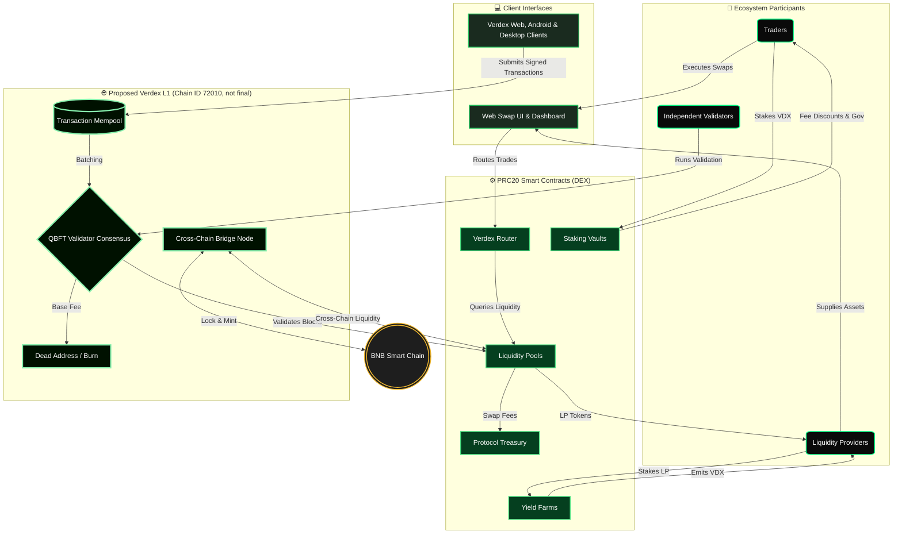
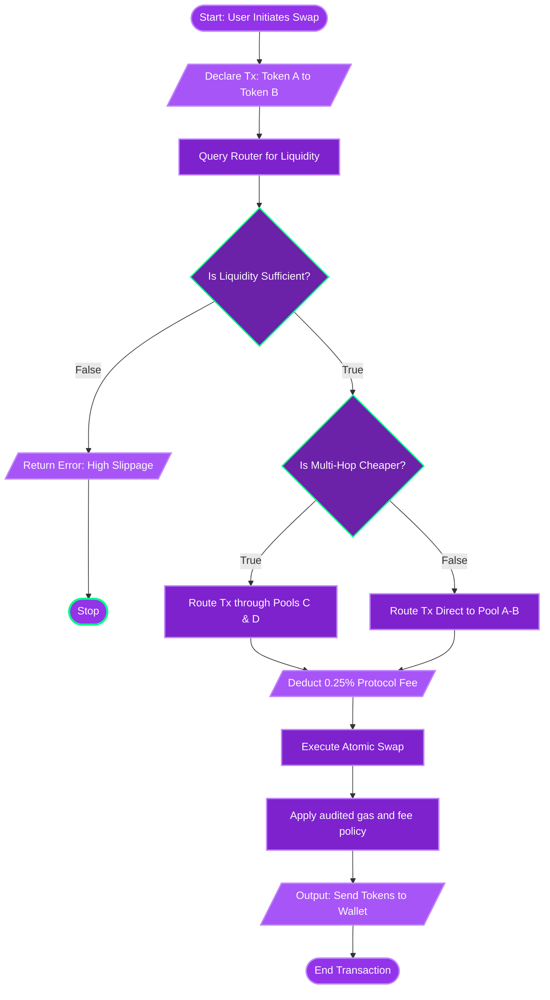
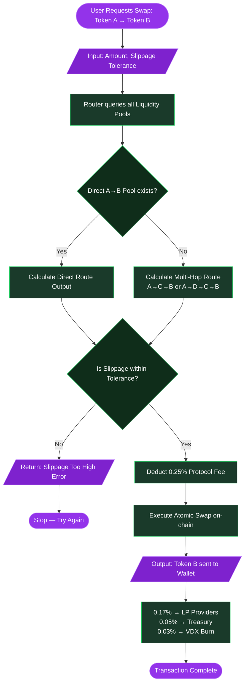
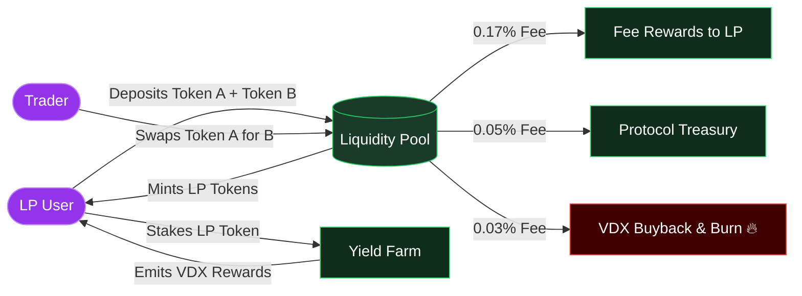
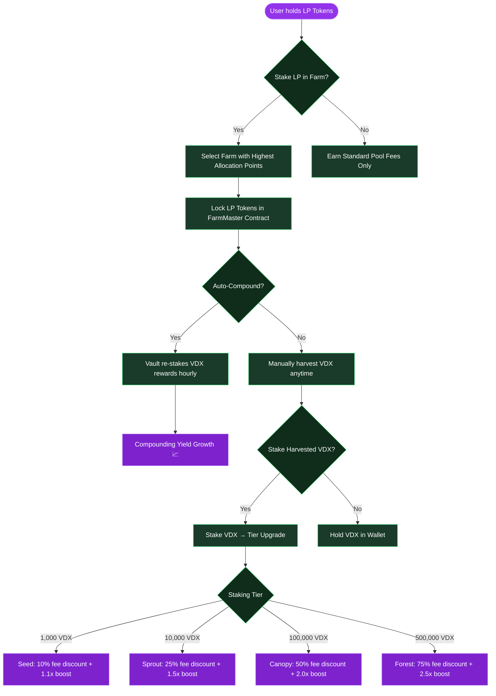
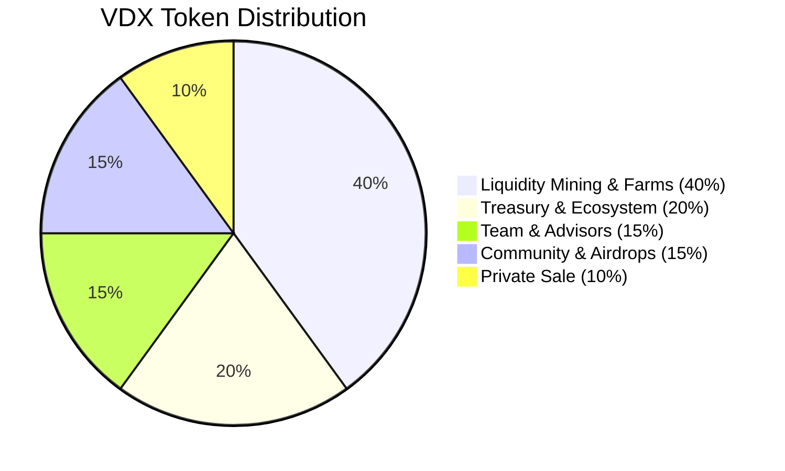
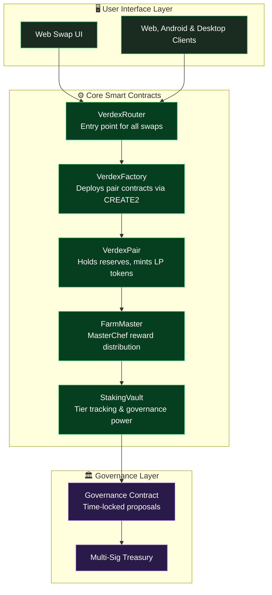
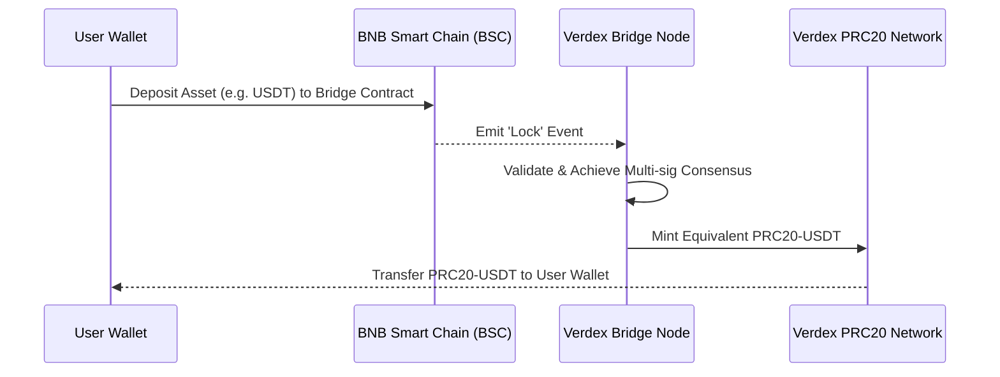
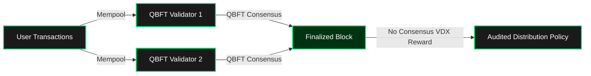

# Verdex Whitepaper
## Version 1.1 | July 2026 | Pre-launch technical update

---

## Abstract

Verdex is a next-generation decentralized exchange (DEX) and DeFi ecosystem engineered to deliver institutional-grade liquidity infrastructure with consumer-grade simplicity. Inspired by the proven Automated Market Maker (AMM) models of Uniswap and PancakeSwap, Verdex introduces a vertically integrated suite of products — Swap, Pool, Farm, and Stake — governed by the VERDEX (VDX) token. The protocol is designed to maximize capital efficiency, minimize slippage, and align long-term incentives among traders, liquidity providers, and governance participants through sustainable tokenomics and transparent on-chain mechanics.

This document presents the intended architecture, economic model, infrastructure stack, product logic, and strategic roadmap of Verdex. It is a pre-launch technical document, not a claim that a public mainnet, VDX contract, bridge, wallet transfer, P2P market, custody system, or KYC intake is live. The legacy testnet has been retired. Any public launch requires a signed genesis, independently controlled validators, verified contract deployments, independent audits, operational KYC/AML approval, and public release evidence.

---

## 1. Vision & Mission

Our vision is to build the most accessible, efficient, and sustainable decentralized trading ecosystem in crypto. We believe that decentralized finance should not require a computer science degree to use, nor should it sacrifice user control for convenience.

**Mission:** Empower every user to swap tokens, supply liquidity, and earn yields with complete custody of their assets, while benefiting from low fees, deep liquidity, and a protocol that rewards long-term participation.

---

## 2. Market Context

Decentralized exchanges have grown from experimental tools into the primary venue for on-chain asset exchange. However, several structural problems persist across the landscape:

- **User Experience Friction:** Overloaded interfaces and confusing workflows push retail users toward centralized alternatives.
- **Capital Inefficiency:** Traditional AMMs often lock large amounts of capital across the entire price curve, resulting in low fee generation relative to deposited value.
- **Extractive Tokenomics:** Short-term emission farming frequently dilutes token holders and collapses once rewards taper.
- **Cross-Chain Fragmentation:** Liquidity is trapped on isolated networks, forcing users to bridge assets through risky or expensive intermediaries.
- **Information Asymmetry:** New users struggle to understand impermanent loss, slippage, and fee mechanics.

Verdex addresses each of these issues through careful product design, transparent economics, and an infrastructure roadmap built for interoperability.

---

## 3. The Verdex Ecosystem

### 3.1 Master Architecture & Full Ecosystem Overview

The following flowchart illustrates the complete macro-architecture of the Verdex ecosystem, mapping out how users, client interfaces, decentralized smart contracts, the proprietary PRC20 blockchain, and external networks (like BNB Smart Chain) all interlock to create a seamless DeFi engine.



### 3.1.1 Transaction Lifecycle Logic

To illustrate the intended protocol logic, here is the decision tree for a Verdex swap transaction after audited contracts are deployed. Consensus does not mint VDX or points as a block reward.



### 3.2 Verdex Swap

Verdex Swap is the primary interface for exchanging tokens. It operates as a decentralized AMM aggregator, routing trades through the most efficient paths across Verdex liquidity pools.

#### AMM Swap Route Logic



#### Constant Product AMM Formula

Verdex pools use the same battle-tested invariant that powers Uniswap V2:

```
x × y = k
```

Where `x` and `y` represent the reserves of two tokens in a pool, and `k` remains constant before fees.

### 3.3 Verdex Pool

Liquidity pools are the foundation of the Verdex protocol. Each pool holds reserves of two tokens and enables trading between them.

#### Liquidity Provision Flow



#### Fee Structure

| Recipient | Fee Share | Purpose |
|-----------|-----------|----------|
| Liquidity Providers | 0.17% | Direct trading reward |
| Protocol Treasury | 0.05% | Development & operations |
| VDX Burn Program | 0.03% | Deflationary buyback |

### 3.4 Verdex Farm

Farms allow liquidity providers to stake their LP tokens and earn VDX emissions on top of trading fees.

#### Farm & Stake Rewards Flow



#### Staking Tiers

| Tier | Staked VDX | Swap Fee Discount | Farm Boost |
|------|------------|-------------------|------------|
| 🌱 Seed | 1,000+ | 10% | 1.1x |
| 🌿 Sprout | 10,000+ | 25% | 1.5x |
| 🌳 Canopy | 100,000+ | 50% | 2.0x |
| 🌲 Forest | 500,000+ | 75% | 2.5x |

---

## 4. Tokenomics

The VERDEX token (ticker: VDX) is the protocol's native utility and governance asset. It is designed to capture value from trading activity while incentivizing participation across the ecosystem.

### 4.1 Token Supply & Distribution

**Total fixed supply: 1,000,000,000 VDX**



| Allocation | Percentage |
|------------|------------|
| Liquidity Mining & Farms | 40% |
| Treasury & Ecosystem | 20% |
| Team & Advisors | 15% |
| Community & Airdrops | 15% |
| Private Sale | 10% |

### 4.2 Token Utility

VDX is not merely a speculative asset. It is embedded into every layer of the protocol:

- **Governance:** Vote on fee structures, farm allocations, supported chains, treasury spending, and protocol upgrades.
- **Fee Reductions:** Staked VDX reduces swap fees proportionally to tier.
- **Farm Yield Boosts:** Higher staking tiers multiply LP farming rewards.
- **Revenue Capture:** 0.03% of every swap is used to market-buy VDX and burn it, creating persistent buy pressure and deflationary pressure.
- **Launchpad Access:** Staked VDX grants priority access to future token launches and ecosystem partnerships.

### 4.3 Emission Schedule

The 400,000,000 VDX liquidity and farming allocation is proposed, but its emission curve is not final. The previous example of 5,000,000 VDX per week with 10% quarterly decay does not reconcile with a 6–8 year runway. Before contracts are deployed, governance and auditors must publish a capped, time-indexed distribution schedule whose total cannot exceed the allocation. No VDX is minted by consensus. Any Android reward programme is a separate, audited, Safe-funded claim distributor with a maximum of 25 VDX per KYC-approved account per UTC day and a global epoch budget.

---

## 5. Protocol Architecture & Infrastructure

Verdex is deployed as a collection of non-upgradeable, auditable smart contracts on EVM-compatible blockchains. The architecture is modular, allowing individual components to be improved or replaced without disrupting the broader ecosystem.

### 5.1 Smart Contract Stack Architecture



- **VerdexFactory:** Deploys and indexes liquidity pair contracts via CREATE2 for predictable addresses.
- **VerdexPair:** Holds token reserves, mints LP tokens, executes swaps, enforces constant product invariant.
- **VerdexRouter:** Handles user-facing operations. Supports multi-hop routing and slippage protection.
- **FarmMaster:** MasterChef-style reward debt accounting system.
- **StakingVault:** Locks VDX tokens, tracks staking tiers, distributes governance power.
- **Governance:** Time-locked proposal and execution system.
- **Treasury:** Multi-sig vault funding ecosystem growth and audits.

### 5.2 Oracle & Pricing

Verdex pools can be configured to expose time-weighted average price (TWAP) oracles. These oracles provide manipulation-resistant price feeds for external protocols, lending markets, and derivatives platforms, creating additional utility for deep Verdex pools.

### 5.3 Cross-Chain Strategy & BNB Smart Chain Integration

Verdex may pursue a multi-chain future, including BNB Smart Chain (BSC), only after a separately audited bridge design and independent operational controls are approved. No bridge is currently deployed or available for assets.



Future versions will expand this interoperability to Ethereum and Layer-2 rollups, enabling unified liquidity, single-sided deposits, and cross-chain yield aggregation.

### 5.4 Verdex Custom L1 Blockchain Protocol

Verdex's proposed custom Layer-1 is an EVM-compatible Hyperledger Besu QBFT network with four independently controlled validators. The proposed chain ID is 72010 and must be rechecked before the genesis ceremony. The core protocol design is:

- **No consensus VDX issuance**: QBFT block reward is zero. VDX is a fixed-supply PRC20 contract token released only from audited, timelocked allocation vaults.
- **Native gas policy**: the native gas asset and any EIP-1559 configuration are separately ratified and published in the signed genesis. They are not VDX token issuance.


- **QBFT finality**: Four validator nodes participate in an authenticated BFT protocol. The intended design tolerates one faulty validator; public addresses alone do not prove independent control.
- **Validator operations**: Validator admission, removal, performance management, and incident response are governed by documented change control. No validator reward or penalty mechanism has been deployed.
- **Priority Mempool Queue**: Features a priority-sorted transaction pool supporting Replace-By-Fee (RBF) overrides. Transactions are evaluated based on EIP-1559 maxPriorityFeePerGas (tips), defending against front-running and spam.
- **Binary Merkle State Verification**: Employs binary Merkle tree indexing for transaction logs and receipts verification, enabling fast SPV (Simplified Payment Verification) validation.
- **Event Log Bloom Filters**: Block headers carry a 256-byte `LogsBloom` filter index, allowing light clients to query logs and contracts events instantly.

---

## 6. Security & Risk Management

Security is the highest priority for Verdex. The protocol implements multiple layers of protection:

- **Third-Party Audits:** All contracts audited by at least two independent security firms before mainnet launch.
- **Formal Verification:** Critical invariants, such as the constant product formula and LP token math, are formally verified.
- **Bug Bounty Program:** A public bounty program rewards white-hat hackers for responsible disclosure.
- **Timelock:** Administrative actions require a multi-day delay before execution, giving users time to react.
- **Multi-Signature Treasury:** Protocol funds require multiple signers and hardware-backed keys.

---

## 7. Governance

Verdex will progressively decentralize into a community-governed DAO. VDX stakers propose and vote on protocol changes. Governance covers:

- Fee tier adjustments
- Farm allocation points
- New chain deployments
- Treasury spending and grants
- Contract upgrades and parameter changes

Proposals require a minimum quorum of participating staked VDX and a majority vote to pass. Passed proposals are queued in a timelock before execution.

---

## 8. Roadmap

| Phase | Milestone | Status |
|-------|-----------|--------|
| Phase 1 | Brand identity, website, whitepaper, and community channels | Completed |
| Phase 2 | Legacy testnet retired. Windows Besu QBFT deployment tooling and pre-launch operational documentation are in development. | In Progress |
| Phase 3 | Independent validator ceremony, signed genesis, audited VDX/escrow contracts, Safe custody, KYC/AML operations, and public verification evidence. | Required before launch |
| Phase 4 | Mainnet launch, governance activation, and public services only after Phase 3 evidence is complete. | Not launched |
| Phase 5 | Advanced products: perpetuals, lending integration, institutional APIs | Future |

---

## 9. Conclusion

Verdex is more than a swap interface — it is a complete DeFi infrastructure layer designed for the next generation of traders and liquidity providers. By combining proven AMM mechanics with sustainable tokenomics, robust security, and an uncompromising focus on user experience, Verdex is positioned to become a cornerstone of decentralized finance.

We invite the community to participate in building, testing, and governing the greenest DEX in crypto.

---

## Contact

- **TikTok:** [@blockchaindevolper](https://www.tiktok.com/@blockchaindevolper)
- **Telegram:** [@VerdixOffical](https://t.me/VerdixOffical)
- **Email:** verdexchainsuppourt@gmail.com
- **Website:** verdexswap.site

**Developed by Suleman** — Other developers will be revealed soon.

---

## Disclaimer

This whitepaper is for informational purposes only and does not constitute financial, legal, or investment advice. Cryptocurrency carries substantial risk, including loss of capital. The Verdex token, mainnet, swap, P2P market, bridge, and KYC document intake are not yet live. No public RPC endpoint or validator service is available from this document. All specifications, allocations, and timelines remain subject to signed technical, security, operational, and regulatory approvals.

---

**Developed by Suleman** — Other developers will be revealed soon.
